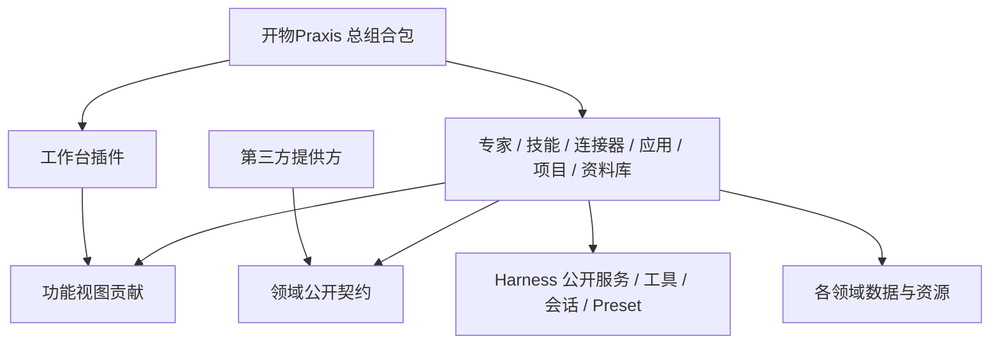

# 架构与目录所有权

## 内置技能目录与管理口径（2026-09-14）

用户确认：由工程精细维护或直接集成的技能属于内置；通过技能管理创建流程制作的是用户技能。内置不是依照当前文件所在用户目录判断。不同插件仍拥有自己的技能，不新建集中技能执行器或万能资源包。

```text
packages/plugins/skills/resources/skills/
  workdsh-skill-creator/SKILL.md + references/
  workdsh-ppt-design/SKILL.md + references/
  workdsh-word-design/SKILL.md + references/
  workdsh-excel-design/SKILL.md + references/
  workdsh-web-design/SKILL.md + references/
packages/plugins/experts/resources/skills/
  workdsh-expert-manager/SKILL.md + references/ + runtime/
docs/workbuddyskills/                 # 原始研究资料，不是运行或打包来源
```

SKILL.md 是入口、元数据与正文唯一可维护来源；references/assets/scripts按需并随所属插件交付。技能插件构建先用官方 filesystem Skill provider 解析工程资源，再单向生成注册内容；generated TypeScript不能独立编辑。专家管理技能继续从包内Markdown加载，路径统一。Office拥有编辑器和输出指令，Skill拥有设计方法；/office.ppt默认加载唯一内置 workdsh-ppt-design，采用合并后的设计方法，不另设 tencent-pptx 入口。

用户发布目录保持官方 Agents/Profile根，由技能管理服务拥有草稿、发布和修订，不被迁移或覆盖。内置通过官方ctx.skills注册为bundled，技能页沿用现有只读保护；编辑内容回工程，随插件更新。当前只读条目不具备技能页独立停用功能，本次不声称该开关已实现。官方 filesystem/provider拥有发现和调用，不把位置推断当作用户创建来源。

已有第三方插件提供的技能（如dsh-ppt-master）属于装配提供的内置能力，继续由其正式插件包管理，不复制其实现到用户技能或开物Praxis模块；版本、许可证和卸载按该插件。用户Agents根中的其他已有技能来源不明，不能按名字批量收进产品或自动搬走。本次明确迁移的用户根副本只有上轮直接集成的tencent-pptx，备份保留后撤出活动根；workdsh-import-test为测试资料，不计入产品内置。

## 核心模型

功能插件是可执行模块；bundle 是安装组合层；专家/技能/连接实例/应用是业务对象。三者不能混同。一个功能插件管理多对象，一个提供方插件可贡献多类型预置对象。

Harness 底座本身是官方插件组合，开物Praxis 业务能力沿用同一套机制，不建立承载全部业务的大核心。用户已确认这一方向，见 [ADR-0018](adr/0018-composable-feature-plugins-and-shared-skills.md)：专家引用技能对象与修订，功能插件通过公开契约协作；独立分发不代表没有依赖，默认产品由统一 Profile 装配。Skill alpha.24 已完成独立 Host/Client、配置层安装与共享本地服务契约验证；默认展示包 alpha.39 不再内嵌初始化 Skill。工作台现通过 ctx.plugin 注册，但尚无独立安装制品；专家的修订引用与业务影响仍待 D04 实现，不能从本轮安装验收推导已完成。见[独立交付证据](evidence/skills-standalone-package.md)。



## 运行与通信

Office是独立`workdsh-plugin-office`功能插件，提供编辑工作副本服务，最终目标为六个content_*工具，Client接官方Tab。U1现已实现五个工具与原生Tiptap文档链路，export及其余七类待后续验收。八类模型共用提交规则，但不形成开物Praxis大核心。Host/工具/Connection通过官方子插件组合，具体[插件边界及生命周期](design/office/PLUGIN-ARCHITECTURE.md)遵循ADR-0018/0019。其多维表格是内容文档，不能接管tables业务数据库；HTML编辑不能接管pages发布；原件和正式资产仍归资源owner/library。

Host 拥有权威数据和变更顺序；Remote 暴露类型化操作；Client model 管理订阅和重连镜像；UI adapter 与 Slots 呈现。官方 Conversation、附件与 Sidebar 优先复用。工作台不直接依赖功能内部 React 实现。

专家任务：解析对象修订与依赖 → 选择已授权连接实例 → 通过原生专业组合创建会话 → 注入受控输入 → 工具执行 → 登记并验证成果。技能是执行指导，不是独立常驻 Agent。

管理任务：expert-manager / skill-creator → 管理工具 → 对应领域服务 → 校验 → 保存/发布 → 返回对象引用。界面调用相同领域服务。脚本可作为技能资源，但导入不执行。

### Web Client 产品组合

最终交付是官方 Web Client 中的 开物Praxis Profile：已安装包以 `dsh.client` 和 `./client` 加入官方 Client module 图，官方 renderer 继续拥有唯一 React root。开物Praxis workbench 通过 `sidebar.brand.*`、`sidebar.panellist` 和配对的 `main` entry 增量贡献品牌与业务页面；Session 执行返回官方 `main.conversation`。首期不替换 `root` 或 `sidebar` owner，不用 iframe、全局 CSS 隐藏默认 DOM 或第二个前端启动器模拟完整产品。完整准入规则见 [Harness 官方开发规范](HARNESS-OFFICIAL-DEVELOPMENT.md)。

Host 领域服务拥有权威状态，生成 Remote 负责传输，Client model 负责可恢复镜像，UI adapter/Slot props 负责呈现。组件不接收 Cordis ctx、transport 或领域 service；跨功能 UI 只通过 Slots 和 packages/ui 的纯展示组件组合。插件是否启用、是否有导航入口、入口位于左栏或设置页分别声明，不能互相推断。

任务正文使用原生 Conversation；可回放的业务节点由 Session event、Conversation Definition 与 renderer 组成。会话相关资料和成果可通过 Client Resource 协议在右侧 Sidebar 预览；该停靠面由 `rightbar.session` 按 Session 拥有，开物Praxis 扩展必须使用公开 tab registry、keyed body Slot、`ctx.sidebarRight` 和 `dsh-resource://` 地址。项目全局配置、全局技能库与主导航属于 main/左栏，不能塞入会话级右栏。可靠重连由每个领域提供 baseline/cursor/query，不能只依赖 WebSocket 恢复或不回放的通知。

任务输入中的图片和通用文件使用官方 Attachment/File Upload 准入链：先持久化和校验，再把不可变内容引用写入 Session；浏览器 object URL、base64、临时路径和 provider URL 不成为持久事实。项目资产是 开物Praxis library 对象，不能直接冒充上传 receipt；提交任务时由 Host 校验资产修订与权限，再通过公开附件/上下文能力生成本次执行引用。跨 Session 引用只提供有预算、不可信的时间点快照，不建立项目共享或持续同步关系。官方 Session title 用于会话显示，业务任务与待办标题仍属于项目领域。

会话级业务视图若能完全由持久 Session 事件推导，使用官方 Session Projection 注册纯同步 fold，并向客户端发布带共同 `asOfSeq` 的全量值。投影不执行异步 IO、不持有订阅，也不作为项目全局数据库；持久缓存只是可陈旧提示，打开会话后的权威快照以更高水位线覆盖。

## 工程布局

- packages/contracts：领域契约和必要公共校验；无数据库、Host 启动或万能业务实现。
- packages/ui：共享展示组件；不持有业务状态。
- packages/bundle：默认组合层；不拥有业务逻辑。
- packages/plugins/*：各功能服务、工具、Remote、Client 与领域持久化。
- examples/provider-education：第三方贡献范例；不是写死在专家中心的内置判断。
- examples/mcp-business-service：可控制失败与幂等行为的测试服务。
- tests/integration、tests/e2e、tests/fixtures：跨模块验收。
- docs/adr：已决定或明确延后的架构选择。

所有目录在首期保留，README 标明状态。完整模块清单是 `docs/modules.json`，由 `scripts/check-plan.mjs` 检查。

## 依赖规则

功能插件可 import 对应 contracts 子路径和官方公开包，不 import 其他功能插件源码。提供方依赖服务定义，消费者依赖相同定义，双方不互相依赖。需要某功能的必需协作声明 `inject`；可选能力使用默认严格模式的 `ctx.get()` 探测并提供未就绪状态。Cordis 配置项并发启动，禁止用 `cordis.yml` 行顺序表达依赖。

默认 bundle 组合功能；领域包可同时承担接口实现与消费，但对外契约位于 contracts。模块卸载时释放注册、连接和订阅，数据默认保留。

### Cordis 插件生命周期约束

- 自有服务使用 `workdsh*` 的唯一服务名，避免 Cordis 扁平服务命名空间冲突；contracts 声明类型和语义，provider 与 consumer 不直接相互 import。
- 每个 bundle 配置项使用稳定 `id`。缺少必需服务导致的 `PENDING`、配置或启动导致的 `FAILED` 必须由启动探针和管理端插件诊断显式展示；进程状态码 0、Client 导航存在或配置项存在都不表示插件处于 `ACTIVE`。
- 服务提供方卸载或替换会让依赖插件重启。插件不得跨 Fiber 生命周期缓存服务句柄；Remote、订阅、连接、定时器、watcher、子进程和临时资源必须由当前 Fiber 的 effect 持有。
- Cordis 自带注册 API 使用其 disposer；框架外资源放入带诊断标签的 `ctx.effect()`。dispose 必须等待工作停稳。需要顺序清理的异步步骤放在同一个 disposer 中串行等待。
- 配置在挂载和更新前通过 Schema 校验；对象引用在能够解析时立即校验。观察型 waterfall 监听器始终调用 `next()`，只有明确拥有否决权的策略才允许短路。
- `disabled` 只卸载运行实例并保留 Loader 条目，不承担业务对象归档、删除或历史修订保留语义。
- 官方 `ctx.tools.register(defineTool(...))` 是模型工具入口；工具 schema、规范输出、Native renderer、`systemPrompt` 依赖和 Session 结果记录必须成套验证。
- 工具授权使用官方流水线的单调 guard，确保后续 hook 不能重新放行；审批、超时、结果改写和 `tools/result` 继续使用公开阶段。Command 适合不经过模型的确定性管理入口，并以权威领域事件引用结果。

## 数据与身份

业务对象 ID 与发布修订分离，任务保存精确引用。公开定义不含凭据；连接实例持有凭据引用。项目 ID 不等于本地路径、Preset 或 Profile。

业务对象通过官方 `ctx.storageDomain` 持久化，每个插件拥有唯一 `workdsh-*` DomainSpec 和类型化句柄；Profile 选择并路由官方 SQLite/JSON provider。领域所有权不要求每领域一个物理数据库，跨域仍只调用服务契约。资源、临时文件和日志分别管理；会话事件由官方 `sessionPersistence` 保存，开物Praxis 只记录业务关联，不复制或迁移其日志。见 [ADR-0011](adr/0011-use-official-storage-domains.md)。

产品任务只通过官方 Session Controller/Agent 生命周期创建；裸 `ctx.sessions.create()` 不作为 开物Praxis 任务入口。Session 作为追加式日志拥有模型消息、工具、步骤、原生审批、目标、工作流、子 Agent 和运行设置等执行事实；业务 Domain 拥有项目待办、自动化规则、企业组织、业务审批和资产修订。原生 todo、schedule、team、approval、deliverable 等近似事件不得直接冒充这些业务对象，完整分界见 [ADR-0012](adr/0012-session-and-business-fact-boundaries.md)。

需要在 Conversation 或 Session Projection 中重放的会话级业务节点才使用自定义 Session event，并携带稳定业务 ID、JSON schema 和升级处置。`session/event` 是提交后通知，不能回滚业务写入；跨 Session/Domain 使用 requestId 与对账恢复。导出、交接及依赖落盘的读取前使用 `flush()`，fork、恢复和继续运行重新校验 开物Praxis 授权及绑定。

对象更新采用预期修订以检测并发修改。归档不删除历史修订；资源垃圾回收只在确认没有引用后进行。进程重启后的精确组合恢复由 P0 验证，不以同进程驻留语义替代持久恢复设计。

## 安全与失败边界

Cordis 插件代码是可信可执行扩展，不等于沙箱。普通专家表单和导入对象不接受可执行插件路径；插件安装和对象创作是不同操作。

工具可见性控制上下文，不代替执行授权。查询、提交、凭据和文件均由服务边界检查；Filesystem observation policy 也只提供新鲜度，不能替代 sandbox 或项目授权。远端写入无法与本地 Domain 形成原子事务，使用操作标识、回执与核对恢复，绝不宣称 exactly-once。

## 从首期考虑团队

组织、主体、成员、资源授权、审计与运行绑定由 identity/access/audit 插件提供共同契约，所有业务插件从首次实现即消费。部署形态为 local 或 team，不是两套业务数据模型。详细规则见 TEAM-DESIGN。

额外功能模块：plugin-identity、plugin-access、plugin-audit、plugin-model-policy、plugin-usage、plugin-admin、plugin-tables、plugin-pages。提供方目录：provider-identity-local、provider-identity-oidc、provider-library-team、provider-runtime-isolated。即使暂不实现，也首期建立目录与任务归属。

技术隔离由 runtime provider 实施。认证用户→组织成员→资源权限→绑定的执行实例→工具权限→外部账号授权逐层校验；runtime 不能仅凭 orgId 字段提供隔离。

官方 Workspace 只表示规范本地目录及其 Session 分组，不是 开物Praxis Project，也不是文件安全边界。项目可以保存一个经过校验的 WorkspaceId 作为本地执行位置，但成员、指令、资产、待办、能力引用与团队部署继续由 projects 领域拥有；Workspace 缺失不能被解释成项目不存在。文件访问仍经过 runtime/filesystem 与项目授权检查，不能凭 cwd 相等放行。

官方 Session Telemetry 是可选外发管道，允许丢失和重复且默认没有脱敏规则。它只用于部署观测，不能替代 audit 插件的权威管理记录；启用时 Profile 必须声明 sharing、脱敏策略、接收端去重与关闭排空行为。

官方 Session Query 用于已授权任务的日志、surface、标题、谱系、事件窗口和全文检索，不承担资料库资产搜索。其原生过滤条件没有组织或项目权限语义，开物Praxis Remote 必须先从 RuntimeBinding/ProjectTaskLink 解析可访问 Session 集合，再限定查询并逐项校验返回结果；禁止把全局 Session 语料库 Remote 直接开放为团队搜索。

官方 Session Controller 声明其搜索结果具有可见/授权语义，正式用户入口优先复用该控制层；H06 在锁定发布包上验证具体策略前，仍保留 开物Praxis 授权 Session 集合的前置限制与返回复核。

官方 `ctx.fs` 提供原子文件操作与不透明 target/version；消费方不解析 target key 或用路径字符串判断包含关系。文件工具必须组合 observation policy 以取得版本新鲜度，同时组合经过验证的 sandbox/runtime provider 和 开物Praxis 授权。先读后写只防陈旧覆盖，不提供目录权限；跨信任边界在 resolve 前检查 symlink。文件 IO 取消是尽力而为，取消或断连后必须读取实际版本确认结果。

官方 Job 是 owner Session 约束的进程内后台工作注册表，不是持久 AutomationRun；开物Praxis 禁止无 owner job，并为多客户端进度提供领域 baseline，而不共享 Job 的单一输出游标。动态 Workflow 是一次 Session 内由模型编写的 subagent 编排，也不等于可发布行业流程。官方 Webhook 仅作为已认证交付适配和 Session 创建候选；它没有队列、重试、去重、崩溃恢复或完成状态，automations 插件必须补齐持久规则、交付、occurrence、运行和对账。

## 项目域补充

项目是持续工作的核心容器，首期独立任务 P1-11，详见 [项目设计](PROJECT-DESIGN.md)。项目配置组织能力引用，资料库拥有内容，Harness 拥有执行事实；待办只表示业务状态。共享配置不共享个人执行身份，新增任务固定配置修订，撤权仍实时生效。

项目 UI 的能力选择器通过公共查询/对象引用契约复用领域服务，不横向导入专家或技能插件组件。projects 拥有项目关联、留言和待办评论；输入引用经服务验证后交给 Harness。详见 PROJECT-DESIGN 第 7 节。

插件独立版本、对象修订与组合版本的管理决策见 [ADR-0006](adr/0006-plugin-delivery-order.md)，固定执行步骤见 [逐插件计划](PLUGIN-DELIVERY.md)。

用户端与管理端的首期拓扑、数据所有权及持久化实施顺序见 [部署与存储](DEPLOYMENT-AND-STORAGE.md)。首期同 Host、独立界面与服务端权限；领域对象使用官方 Storage Domain，资产使用受控文件存储，不为两个前端复制业务数据。

packages/plugins 是非包目录，skills/experts 等子目录各自拥有独立包身份和版本。目录调整不合并业务实现、数据或生命周期。详见 [ADR-0008](adr/0008-plugin-directory-grouping.md)。

提供方工程路径为 packages/providers/<name>；父目录仅分类，各子提供方仍独立发布和管理生命周期，见 [ADR-0009](adr/0009-provider-directory-grouping.md)。

## 跨功能执行组合：Agent preset、业务角色与工作范围

依据已锁定的 @deepseek-ai/dsh-agent-presets@0.1.5-rc.1 发布包 README.zh.md 核对；以下原生行为仍需 P0-03 运行验证。

专家是 开物Praxis 业务对象，preset 是会话能力组装，Session 是执行实例。专家发布修订引用经过验证的能力组合，任务解析该引用后创建原生会话；不要求每位专家独立 npm 包，也不强制每位专家复制整个 preset。复用组合必须保持对象修订和实际执行配置可追溯。

- 标准模式：通用任务能力的候选基线。
- PTC 模式：多步工具程序组合的候选，单独验证后使用，不预设其更快或更省。
- 极简模式：用于特定开发诊断，不作为业务默认；截图描述和发布包关于工具数量存在差异，实际以锁定版本配置及探针结果为准。
- 创造模式：专家、技能、预设及行业应用配置的创作辅助；实际创建、校验和发布仍调用对应领域服务，不等于管理服务本身。

原生支持从既有 preset 复制目录，展示 broken 原因，以及空会话切换；已有内容的会话不能任意改换组合。默认值变化影响新会话。P0-03 实测表明，同一 ID 的文件被改写后，历史 Session 在 Host 重启时会采用新组合；目录删除后官方技能查询会成功返回空目录。因此发布组合使用不可变、带修订的 preset ID，仍被 Session 引用时禁止物理删除，并在恢复前校验摘要与健康状态，见 [ADR-0010](adr/0010-immutable-preset-revisions.md)。专家交接继续遵守新任务关联与受控摘要规则。

开物Praxis 仍负责专家资料、发布版本、项目绑定、团队授权、连接实例选择和审计；preset 组装隔离不是 OS/租户安全边界。模型生成配置先作为草稿校验，不让创造模式直接授予任意插件或账号权限。当前未将创造模式暴露为普通用户必须理解的配置步骤。


执行组合是工作台、专家、能力创作、行业应用和自动化共用的执行基础，不限于专家。业务角色（可选专家）、执行组合（preset 与能力）、工作范围（项目/资料/连接账号）分别解析；普通任务允许没有专家。一个专家可用于多个项目，一种组合可服务多个角色，但不得共享任务可变状态或越权复用账号。

Harness scope 只有全局和单 Agent 两层，subagent 的 lineage 不会自动继承 scope-local 注册。专家团或专家交接创建新 Agent 时必须重新解析并校验执行组合、资料范围和连接账号；父子关系仅用于追踪，不能作为能力或授权继承机制。

`ResolvedExecutionBinding` 是一次任务的不可变解析结果：记录 ExpertRevision（可空）、preset 修订与组合摘要、精确 provider/model/reasoning effort、SkillRevision、模型可见工具、项目/AssetRevision、ConnectionExecutionBinding、runtime policy 和授权修订。模型目录只是发现信息；精确路由 adapter 的解析结果才是上下文容量、输出上限、推理强度和模态的权威。显式指定但不支持的推理强度必须在 provider I/O 前拒绝，不能静默降级。

专家的系统提示词、项目/资料动态上下文和工具 schema 通过官方 SystemPrompt 在 Agent scope 内统一组装。使用稳定段名与中央排序；同名 scoped 项覆盖 global，`complete` 段会独占提示词，因此一个组合只能有一个经校验的 complete owner。模型实际看到的系统提示词和动态上下文由官方 Agent loop 形成耐久 surface 节点，开物Praxis 不在组装后追加隐藏提示词。

多专家协作分为一次性 Subagent、可继续子 Session 和实验性 Agent Team 三层运行原语。一次性运行必须等待唯一结果并 dispose 到停稳；可继续子代理通过唯一 inbox 接收消息，接受后独立于调用方取消；interrupt 仅表示中断请求已接收。Agent Team 的 TeamId/成员/mailbox/task DAG 只属于根 Session 内协作，不创建 Organization、Membership、ExpertTeamRevision 或项目 WorkItem。`writeScopes` 也不是锁，业务写入继续使用领域修订和幂等控制。完整映射见 [Agent 与专家编排矩阵](research/harness-agent-composition-matrix.md)。

原生 `composeFrom` 可显式把子 Agent 连接到父 Agent 当前正在运行的同一 standing preset generation，适合同角色、同组合委派；它只复用插件实例，不继承 RuntimeBinding、资料或连接授权。不同角色挂载各自不可变 preset 修订。`followup()` 只形成入队事实，MessageId 不指向某次 Assistant 结果；任务结算从持久 Session 事件及明确拥有的运行区间推导。产品切换 preset 只调用带空会话保护的 `select`，不直接用 `recompose`。

Compaction 仅收缩模型 surface，不删除业务数据库中的项目、资料、成果、专家修订或连接回执。未配对 start、部分 commit 和 persistence failure 必须保留诊断；压缩摘要按 Session 内容权限管理。TokenMeter 仅提供单 Session 请求压力和估算/usage 基线，组织用量与计费事实继续由 usage 领域按主体和执行绑定聚合。

DeepSeek 官方 adapter 的 `dsh_plugin_packages` 会把 live 包名/版本发给实际 baseURL；可选 `dsh_session_log` 会把未经脱敏的会话后缀发给该端点，HTTP 2xx 水位只表示端点接受请求且可能至少一次重复。正式团队 Profile 默认关闭会话日志扩展；启用前由组织外发策略验证端点、范围、保留与接收方去重。Python SDK 的 `sdk-minimal` 是独立 danger-full-access headless Profile，不是 开物Praxis Web 外壳或正式隔离运行方案。

workbench 负责组合选择与任务创建适配，contracts 声明受控引用；原生 preset 服务继续拥有运行组装，不另建加载器。experts 负责角色修订，applications 负责场景默认组合，projects 负责范围和绑定，automations 负责计划及执行主体，access 负责授权。纯 UI 组件不解析这些业务规则。

新任务显式选择优先于应用推荐和部署默认，但必须先经过组织策略与能力可用性检查；禁止以静默合并所有工具满足需求。项目绑定提供范围而非授予权限；专家必需能力缺失时明确失败或要求重新选择。已有内容的任务需变更组合时创建关联任务；不在会话中途替换 preset。自动化固定已核验组合引用与主体，触发时重新检查权限；失效或修订缺失则停止并诊断，不自动切到标准模式。

### 官方 Skill 子系统作为唯一执行底座

开物Praxis 的技能插件管理技能业务对象、草稿、发布修订、组织授权、项目/专家绑定与审计；技能发现、目录合并、`/name` 用户调用、模型按需加载和工具结果记录均复用 Harness 官方 Skill 子系统。运行链固定为 `dsh-skill` 注册表、官方提供方（首期为 `dsh-skill-filesystem`）、`dsh-tool-skill`、`skills/list` Remote 与官方 Web `/` 菜单。开物Praxis 不复制 SKILL.md 解析规则，不建立第二套技能注册表，也不绕过原生 Session/preset 作用域。

官方 provider 的 Skill 正文每次调用重新读取，目录摘要不因正文修改自动变化。因此 开物Praxis 发布修订必须投影到不可变内容位置或内容寻址 provider；历史 Session 与 ExpertRevision 解析精确 SkillRevision，不指向同名可变 latest。`modelInvocable`/`userInvocable` 只控制调用面，组织与项目授权仍由 provider 和任务解析服务执行。不完整目录保留 last-good 并重试，不能当作卸载。

MCP client 是 connectors 的一种官方执行适配：复用 stdio/Streamable HTTP 生命周期、工具发现、统一命名与重连。ConnectorDefinition/ConnectionInstance 仍拥有安装前置、URL、凭据引用、外部身份、健康和审计；MCP 不覆盖专用 API、Web seam 或其他连接类型。工具暂时仍列出不表示服务健康，任务提交必须使用连接状态机和执行前检查。

官方 Web seam 的 search/fetch provider 必须显式或唯一解析，不能按注册顺序回退。HTTP provider 的私网阻断只解决 SSRF，不防止向公开地址外发数据；团队部署通过工具 guard、审批和组织策略控制敏感项目内容外发。

业务技能发布时由 skills 插件生成或安装到受控提供方，再由官方注册表发现。preset 只决定某会话挂载哪些技能提供方与工具；专家、项目和应用保存经校验的业务修订引用，不能把前端展示卡片当成已加载技能。组织授权仍由 开物Praxis 服务端检查，官方目录可见性不单独构成授权证明。

技能的业务归属是用户或组织，安装后的全局技能默认供所有 开物Praxis 业务任务解析。项目可以追加项目技能，preset 可以追加或覆盖运行组合，但 Session 只是某次解析后的消费视图，不拥有技能。技能管理页查询全局目录；任务详情查询最终解析目录。rc.1 的公开 `ctx.remote.skills` 仅提供 Session 视图，因此当前 Client 切片以已有 Session 的官方目录做只读汇总；它不能作为完整安装台账。正式管理链必须通过生成的 开物Praxis Host Remote 投影无 scope 的 `ctx.skills.list()`，待外部包 Remote 生成兼容问题解决后替换，禁止长期以汇总推断安装事实。

## 配置、凭据、许可与隔离分层

H06 将治理链固定为不同所有者，不合并为一个“权限”概念。Settings 保存 schema 约束的用户运行偏好和部署参数；开物Praxis Storage Domain 保存组织策略、授权和业务对象；Credentials provider 保存秘密；Approval 处理单次工具操作；Permission Preset 仅组合审批与文件 sandbox 的界面选项；runtime provider 负责进程、网络与租户隔离。

所有向 Client 暴露的 Settings 描述都必须脱敏并使用 expected revision 更新。Credentials 每次外部操作重新解析，ConnectionInstance 只保存引用、目标指纹和外部主体。角色授权、连接使用权和单次工具审批依次校验，任何一层放行都不能提升其他层权限。

官方 Sandbox 只限制子进程文件系统影响，且可能是 `partial`；它不限制网络和进程可见性。团队任务需要强保证时拒绝 partial，或交给已验证的 container/microVM/remote runtime provider。工具网络外发另经单调 guard、连接范围和组织策略。

开物Praxis 一元领域操作使用生成的 Typert Remote；Host 方法入口恢复 ActorContext 后执行授权，lookup/context identity 解析不视为授权。事件流、分页、会话跟随和长期任务进度使用专用 baseline/cursor 协议。详细复用边界见 [治理能力复用矩阵](research/harness-governance-capability-matrix.md)。

H09 校正：上述一元方法是首期实现选择；Typert 专题还声明 stream descriptor/Gateway，实际发布支持须在 rc.1 验证。流式传输不会自动提供领域重放与去重。原生 Todo 无稳定条目 ID，Plan 是软提示，Goal 是单 Session 目标，均不能承担项目业务状态。

取消与完成分层：Code runtime 停止模型程序后仍需核对在途 Host 调用；Shell exitCode 0 不排除 timeout/abort；Subprocess done 不证明受管范围清空；PTY idle 不证明前台完成。业务服务保存实际回执与待对账状态。完整补充见 [审查收尾](research/harness-review-closure.md)。

## Desktop 托管技能运行环境（设计待实现）

Desktop 提供可分发 Python 和精选依赖，Harness 仍拥有执行与沙箱；依赖隔离不是安全隔离。正式集成须先验证锁定版公开配置和沙箱策略，不修改 Harness 本体或另建执行器。解释器按安装位置动态定位，用户技能与成果不随运行环境升级删除。详见 [托管运行环境设计](design/desktop/MANAGED-RUNTIME.md)。
