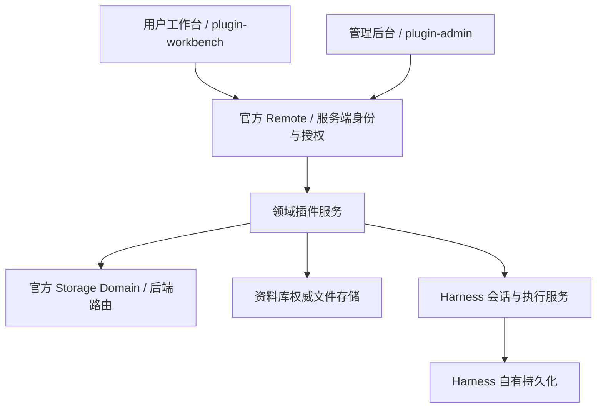

# 用户端、管理端与数据库

状态：本地首期拓扑明确；identity、access、audit 和 Session owner binding 已通过官方 Storage Domain 持久化，后续领域仍从各自模块开始时实现。企业服务器、数据库和管理 Web 后期独立排期。

## 1. 首期两个界面入口，一个 Host

用户端和管理端在同一仓库、同一个 Harness Web 宿主中，以独立导航/布局展示；具体路由经 P0 Client 探针确定。浏览器不直接连接数据库，也不持有数据库/外部服务密钥。管理页面使用相同领域服务的管理操作，不能绕过资源授权。

首期不另建第二套前端构建或 API 服务器。以后有独立域名/前端部署需求时，可以拆分界面部署，但共享服务契约、主体与数据源；必须另行验证跨域认证和 Remote 接入，不能承诺只改域名就能完成拆分。

“同一个服务端”不等于“同一个权限”：个人对象、项目共享和组织治理有不同授权。组织管理员不自动读取成员私有会话。当前本地提供方只适用于可信本机用户，不能直接开放公网作为团队服务。

## 2. 数据分工

| 数据 | 所有者与持久化 |
| --- | --- |
| 组织、成员及身份映射 | identity 领域的官方 Storage Domain；local/SSO 提供身份验证结果 |
| 授权、资源访问规则 | access 领域的官方 Storage Domain |
| 专家、技能、应用及修订 | 各自领域的官方 Storage Domain；包资源与用户创作分开 |
| 项目配置、待办、留言与引用 | projects 领域的官方 Storage Domain；引用不复制其他领域正文 |
| 连接定义、实例元数据与身份绑定 | connectors 领域的官方 Storage Domain；只保存凭据引用 |
| 密钥和令牌 | 经 P0 验证的专用凭据机制，不明文写入业务库/前端/对话 |
| 资产目录、来源、修订、索引 | library 领域的官方 Storage Domain |
| 资产正文、附件和受控工作副本 | library 管理业务资产；执行输入通过官方 Attachment Store 形成不可变内容引用，元数据不保存 object URL、base64 或任意宿主路径 |
| 自动化规则、触发及运行关联 | automations 领域的官方 Storage Domain，由 Host 管理 |
| 审计及用量事实 | audit/usage 各自持久化，去重/保留策略独立 |
| 对话、工具调用和原生运行事实 | Harness 自有存储，开物Praxis 仅保留关联和授权绑定 |

原生 Session Catalog 中的 todo、schedule、team、approval 与 deliverable 仍属于执行日志语义，不替代项目待办、自动化规则、企业组织、业务审批和资料资产。业务对象与 Session 通过稳定引用连接；导出、交接或依赖持久化读取前使用官方 Session flush，跨存储失败以 requestId 和对账恢复处理。

## 3. 首期落地约束

业务对象通过官方 `ctx.storageDomain` 持久化。每个领域插件声明唯一的 `workdsh-*` DomainSpec，并只持有自己的类型化 Domain 句柄；Profile 负责把领域路由到官方 SQLite 或 JSON provider。一个后端可以承载多个 unit，因此不把“领域所有权”误写成“每领域必须有一个物理 SQLite 文件”。管理端与用户端共享同一权威领域数据，跨领域只调用服务契约。

后端路由、DomainSpec 版本、校验、并发写入和关闭行为在 P0-04/D02 验证；首次领域实现必须具备 schema/version、组织与所有者字段、约束、预期修订更新及重启持久化测试。写入只有在 provider 持久化成功并更新内存后才视为提交；`domain/changed` 是提交后的进程内通知，不是事务参与者或跨进程同步机制。浏览器刷新不是数据保存机制。

跨领域使用操作标识、回执和可恢复关联，不宣称跨 Domain 原子事务。备份要同时考虑领域元数据和资产内容的一致性；不得仅复制正在写入的底层介质就声明备份成功。后端及备份脚本交付时记录明确恢复验证。

权威存储对通用 Agent 写入的保护按 ADR-0007 验证；位于另一个目录不构成隔离。Storage backend、Domain 句柄和资产目录都不能暴露给 Agent 任意 SQL、文件或 shell 操作。存储选择见 [ADR-0011](adr/0011-use-official-storage-domains.md)，Session 与业务事实分界见 [ADR-0012](adr/0012-session-and-business-fact-boundaries.md)。

## 4. 团队部署

P3 的共享服务端数据库、对象存储和部署拓扑需专门 ADR 与迁移测试后确定，当前不锁定具体数据库产品。领域契约与组织归属字段从首期保留；迁移需要显式归属映射、权限重验与重新绑定连接，不承诺无成本切换数据库。

D02 复用已经完成的本地 identity/access/audit DomainSpec，继续收口工作台；后续插件逐步加入各自领域 Domain。当前本地存储证据不等于企业数据库、跨节点同步或租户隔离已经完成，后者见[企业版架构说明](ENTERPRISE-EDITION.md)。

## 5. 设置、凭据与部署状态

官方 Settings 存储插件/用户可编辑运行偏好，不能替代业务 Domain。外部读取始终脱敏，写入携带 section revision；组合 `base` 与用户覆盖的解析结果也不能成为 OrganizationPolicy 的权威记录。

凭据由官方 Credentials seam 的具体 provider 持有。业务数据库只保存 credential reference、ConnectionInstance 和外部账号指纹；每次外部操作重新解析秘密。备份方案必须分别说明领域数据库、资产正文、Harness Session 和凭据 provider，不能因复制 SQLite 就声称所有连接可恢复。进程环境来源不可由管理页面覆盖，迁移到团队部署时需重新绑定或重新授权。

文件 Sandbox 不是部署隔离：它不约束网络或进程可见性，且可能只达到 partial。团队部署仍需 runtime provider 提供独立进程/容器、工作区、最小环境和网络策略；准入检查记录实际 enforcement level。

DeepSeek 官方请求扩展另设外发开关：`dsh_plugin_packages` 会把 live Loader 包名和版本发送给实际 baseURL，`dsh_session_log` 会发送未经脱敏的连续 Session 后缀，范围可含 cwd、提示词、用户/Assistant 内容、工具参数与结果、压缩摘要和插件事件。团队 Profile 默认关闭 `dsh_session_log`；启用时必须登记目标端点/网关、组织策略、用户告知、接收方连续性校验、重复处理、保留与删除。HTTP 2xx 的本地接受水位不证明 SSE 完成或远端持久化。

Python SDK 的 `sdk-minimal` 运行独立 headless Profile，缺少 settings、托管凭据、subagent 和 compaction，且使用 danger-full-access。它可作为隔离的一次性集成客户端，但不承载 开物Praxis Web、团队权限或正式 runtime isolation。
