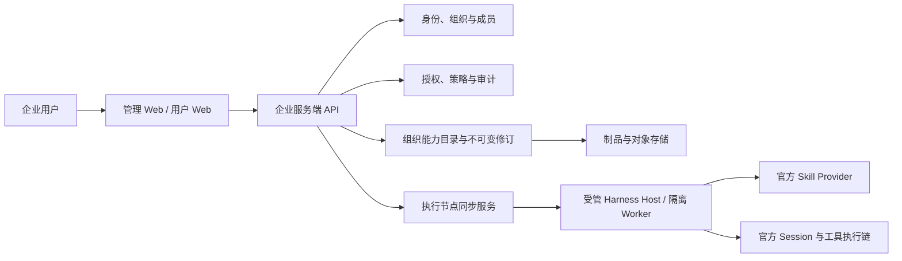

# 企业版架构说明与后期开发记录

状态：**后期 ToDo**。本文保存企业版的架构方向和进入条件，不属于当前本地单用户版本的完成门槛，也不授权当前阶段提前建设公共 Skill 市场、企业服务端或管理 Web。

## 当前产品边界

当前 开物Praxis 面向可信本机用户，继续使用 DeepSeek Harness 的默认/本地 Skill、原生 Session、Conversation、Workspace、权限预设和执行链。开物Praxis 已建立可复用的本地治理基础：Host 解析主体、个人组织、资源授权、Session owner/runtime binding 和审计，并通过官方 Storage Domain 持久化。

这些基础保证本地数据从创建起具备明确 owner 和修订，但不等于企业远程认证或多人隔离已经完成。当前组合不得直接暴露为公网多人服务。

## 后期企业版目标形态

企业版按控制面和执行面分工：

- 企业服务端是组织、成员、授权、组织能力目录、不可变版本、下发策略和审计查询的数据真源。
- 管理 Web 只调用服务端 API，不直接改写执行节点文件，也不建立另一份组织数据。
- Harness Host 或隔离 Worker 是执行节点；它只同步当前主体被授权的精确修订，校验摘要或签名后原子投影到官方 provider。
- 浏览器传入的 principalId、organizationId、role 或 owner 都是不可信提示；ActorContext 必须由服务端认证结果在 Host 信任边界解析。
- 成员停用或授权撤销后，新的调用立即拒绝；可协作取消的在途运行应停止。已经提交到外部系统的写入不能伪称可撤回，需要回执和补偿流程。

## 对当前代码的复用边界

当前 `Praxis-contracts`、local identity、access、audit 和 Session owner binding 是企业版的领域基础，可以保留消费方接口。企业实施时需要增加服务器认证 provider、组织数据源、受控 Remote/API、执行节点同步和部署隔离；不会把本地配置身份直接升级为企业身份，也不会把当前内部 Host Service 当成已经完成的公网 API。

DeepSeek Harness 继续拥有模型调用、Session、Conversation、Skill 发现与加载、工具执行、Permission Preset、Approval、Sandbox 和 Credentials。企业服务只补充业务组织、资源授权、策略、审计和修订分发，不复制这些运行时。

## 后期工作包

1. **E01 企业契约与部署 ADR**：认证协议、租户边界、API、数据库、对象存储、密钥、备份和灾备。
2. **E02 企业服务端与管理 Web**：组织、成员、角色、资源授权、审计查询、组织 Skill 和发布策略。
3. **E03 执行节点管理**：注册、心跳、版本兼容、精确修订同步、摘要/签名校验、last-good 与回滚。
4. **E04 运行治理**：受控 Session/文件/工具入口、全路径授权重查、成员撤权、在途取消和外部操作回执。
5. **E05 企业验收与运维**：双组织/双主体、跨设备、离线、冷启动、密钥轮换、备份恢复和审计留存。

公共 Skill 市场不在上述工作包内。后续如立项，作为独立来源接入企业目录，并与组织私有能力、本地个人能力明确区分。

## 进入条件

企业版在本地核心模块及其组合验收稳定后单独排期。启动 E01 时为企业模块建立自己的 `0.1` 版本线，重新核对届时的 Harness 官方文档与发布包，不沿用未经验证的 wire 格式或部署假设。

