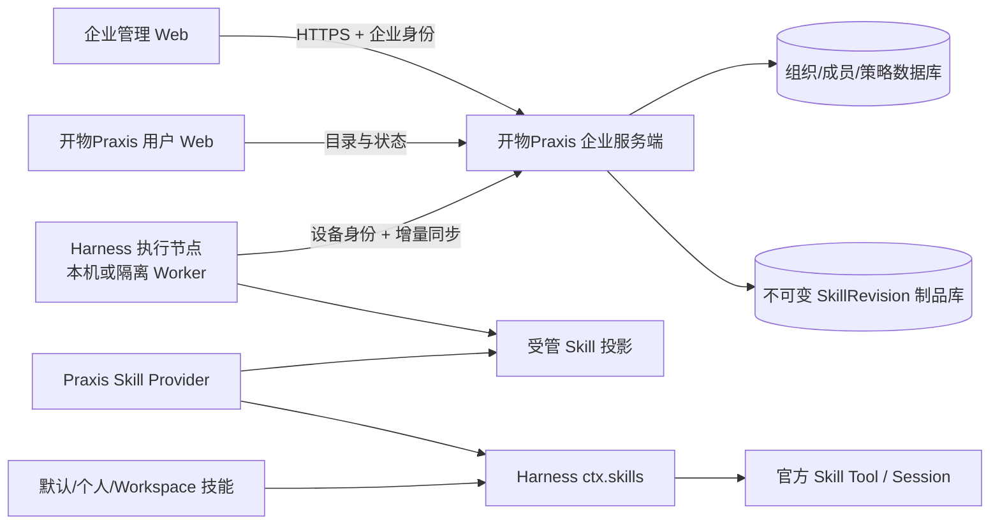

# ADR 0015：企业 Skill 服务端、管理 Web 与 Harness 执行节点

状态：已采纳为后期架构 ToDo，2026-09-11。当前不进入实现。

## 背景

开物Praxis 当前 Skill 0.1 已覆盖默认/本地技能的发现、详情、编辑、资源、启停、导入、创建、依赖检查、批量管理和可恢复卸载。产品当前没有公共 Skill 市场，也不需要自建公共目录；用户继续使用 Harness 默认技能和本地安装技能。

WorkBuddy 企业后台把组织 Skill 管理分为 Skill 列表、分类管理、下发策略和成员自定义 Skill 策略。该流程说明企业能力需要中心化管理、组织权限和多端下发，不能扩展为浏览器直接管理某一台执行机器的文件目录。WorkBuddy 只作为产品参考；DeepSeek Harness 的 `ctx.skills`、provider、scope、官方 Skill Tool 和 Session 运行记录仍是技术执行底座。

## 当前决策

1. 当前不开发公共技能市场、公共目录、SkillHub 或套件。技能页以 Harness 默认/本地已安装集合为真实数据源。
2. 当前没有真实分类数据时只显示“全部”，或保留明确禁用的设计位；不能提供无结果的可点击筛选。
3. 当前 Skill 0.1 以默认/本地管理闭环为完成范围。企业能力放入后期 ToDo，不用未开始的企业需求阻塞当前版本，也不预先命名为 Skill 0.2。
4. 未来企业版采用独立服务端和管理 Web。管理后台不放进本地 `SkillManager`，也不把某个 Harness Session 当作企业数据真源。

## 后期企业拓扑

### 服务端控制面

企业服务端未来拥有 Organization、Membership、Skill、不可变 SkillRevision、组织分类、发布状态、下发策略、成员个人上传策略和审计。公共市场不在当前范围；如果以后需要，由平台运营目录作为另一来源接入，不能与组织资产混为一个权限域。

服务端 API 必须从认证边界建立 `ActorContext`，按 organization、principal、action 和 resource 校验。Client 提供的主体或组织 ID 不是可信身份。Skill 大制品使用对象存储或受控制品存储，元数据和策略进入事务数据库。

### 管理 Web

管理 Web 是独立前端，调用企业服务端 API，提供组织 Skill 列表、分类、版本、状态、可见范围、下发策略和成员上传策略。它不直接访问执行节点文件系统，不拥有第二套 Skill 数据库，也不授予组织管理员宿主 npm 插件安装权、成员私有会话正文或个人凭据。

### Harness 执行节点

执行节点可以是用户机器上的 Harness Host，也可以是企业服务端调度的隔离 Worker。它以设备身份和当前主体同步被授权的精确 SkillRevision，验证路径、大小、摘要/签名和兼容性后原子物化，再通过公开 Skill provider 贡献给 `ctx.skills`。

`/name`、模型自动选择、正文加载和执行仍由 Harness 官方 Skill Tool 与 Session 拥有。上传、同步和发布阶段不执行脚本；实际调用时同时经过 开物Praxis access、Harness approval 和 sandbox/runtime。历史 Session 保存精确 revision/provider/locator，不因同名更新改变正文。

## 企业领域边界

- 平台默认技能、组织技能、个人技能和 Workspace 技能分源展示与解析。
- 分类是独立组织对象；删除分类只解除关联，不删除 Skill，也不写入 Harness `SKILL.md` 私有 frontmatter。
- 组织下发策略控制成员能使用哪些组织 Skill；成员能否上传个人 Skill 是独立策略。拒绝规则优先于允许规则。
- 个人启停是用户偏好，不能越过组织拒绝策略。有效调用还需目标修订可取得、依赖健康和 Harness scope 允许。
- 发布生成不可变修订。更新产生新修订；停用和撤权阻止新的解析，不能伪造已经提交的外部副作用回滚。

## 同步、离线与失败

- 缓存键至少包含 organizationId、principalId、deviceId 和 catalogRevision，不能只按技能名称缓存。
- 下载先进入暂存区，校验成功后原子切换；中断、摘要错误、非法路径或兼容失败时保留 last-good。
- 增量同步使用游标/目录版本并保持幂等。断线时明确显示最后同步时间，不伪报最新。
- 收到撤权或停用后，新的调用失败关闭并撤出受管投影；同步状态不确定时不静默升级或回退。
- 两个主体、两个组织、白名单、黑名单、默认策略、成员上传策略、冷启动恢复和跨组织拒绝都必须有集成测试。

## 模块与版本

后期开始企业版时至少拆为：企业服务端、管理 Web、身份/授权/审计提供方，以及 skills 插件的企业目录适配器。每个模块开始实现时建立自己的 0.1 版本线。当前 `workdsh-plugin-skills` 的 0.1 不因后期企业规划改成 0.2。

当前不创建企业服务端包、不发布企业契约、不显示企业管理假入口。ToDo 见 [后期任务](../TODO.md)。

## 参考

- [WorkBuddy 企业 Skill 管理](https://www.workbuddy.cn/docs/enterprise/adminguide/Skill%E7%AE%A1%E7%90%86)，作为产品管理流程参考。
- [Harness Skills 官方说明](../dsh-v0.1.6-alpha.2/subsystems/skills.zh.md)，作为 Skill registry/provider/scope/运行接口依据。
- [企业管理后台设计](../ADMIN-DESIGN.md)、[团队设计](../TEAM-DESIGN.md)、[公开契约](../CONTRACTS.md)。
