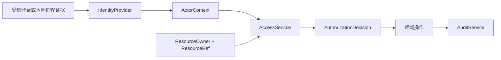

# ADR-0016：先发布治理契约，再实现本地与企业提供方

状态：已采纳。日期：2026-09-11。

## 背景

Skill 0.1 已完成默认/本地管理闭环。下一阶段需要 identity、access、audit 和工作台共同使用主体、组织、资源归属与授权信息；未来企业服务端也必须保持同一语义。Harness 的 User、Permission Preset、Approval、Sandbox 和 Session scope 各自拥有运行职责，但不提供 开物Praxis 的组织成员关系或业务对象授权。

## 决策

建立无 UI、无数据库、无传输依赖的 `Praxis-contracts` 包。首个版本只发布治理对象、服务接口及必要运行时边界校验。ActorContext 只由 Host 上的 IdentityProvider 从受信证据解析，页面、Remote 参数、模型和工具输入都不能直接构造可信主体。

具体实现分三层：本地 provider 用于可信单用户 Profile；D02 的 access/audit 服务消费同一契约；后期企业服务端替换身份和持久化提供方，但不改变领域插件收到的 ActorContext 与 AuthorizationDecision。

## 备选方案

- 各领域自行定义用户和权限字段：初期代码少，但跨插件会产生不一致的越权规则，拒绝。
- 直接把 Harness User、Permission Preset 或 Session scope 当作业务授权：它们没有完整组织和资源归属语义，拒绝。
- 现在实现完整企业认证和数据库：超出本地下一阶段需要，增加不可验证的运维复杂度，延期到企业阶段。

## 后果与风险

- 收益：个人版和企业版共享类型；页面与 Agent 工具可以走同一领域授权；跨插件不传内部数据库对象。
- 成本：所有写操作都需要 ActorContext、授权结果和审计回执，接口更显式。
- 风险：纯类型不能建立信任。P0-05 必须用两个主体、两个组织及伪造客户端身份负例验证真实 Host provider；未通过前不得开放团队远程入口。
- 运维：该包不加载 Cordis、不注册 Remote，也不保存状态；provider 的生命周期、Storage Domain 和迁移由各实现包负责。
