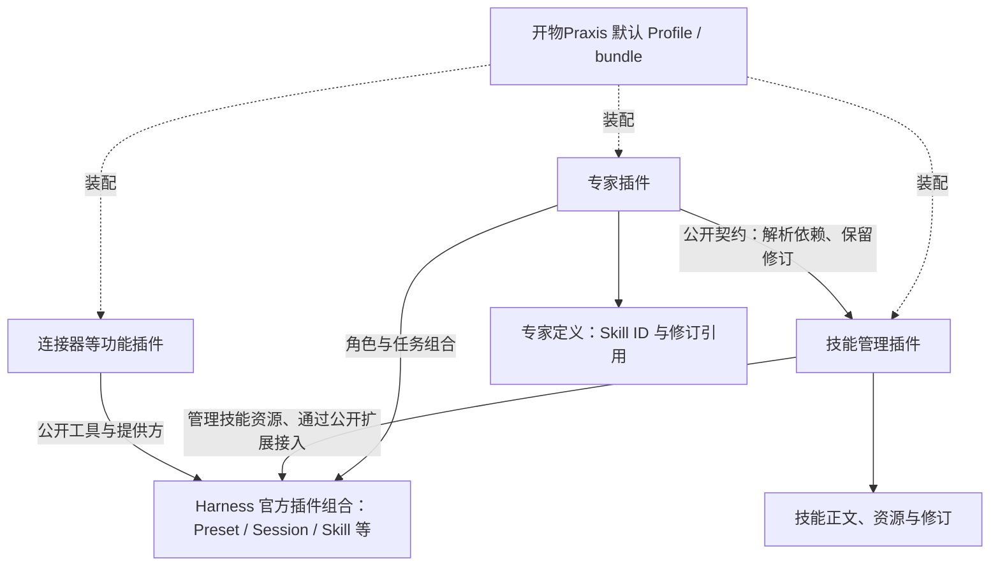

# ADR-0018：独立功能插件、共享服务与专家技能引用

状态：Accepted（Skill 独立交付已验证；专家业务修订引用与其余模块独立分发待对应模块实施）
日期：2026-09-12
关联：ADR-0001、ADR-0003、ADR-0017；D04 前置插件交付修正。

## 背景与目标

用户希望全平台功能插件化，同时专家能包含技能。独立分发不应造成每个专家复制一套技能实现，也不能把有依赖的功能描述成可以任意卸载而不影响其他模块。

本方案沿用官方 Harness/Cordis、当前锁定发布包和本地单用户交付。目标是可独立安装、可组合、可定位故障、共享数据所有权明确，并保留历史任务的依赖引用。当前不增加公共市场、企业服务器、第二套插件加载器或跨进程服务总线。

## 决策

采用官方的插件组合体系：Harness 运行底座本身由官方插件组合，开物Praxis 业务能力继续通过同一套 Cordis 服务、生命周期、Loader 与 Profile 扩展。不在其上建立一个承载全部业务的 开物Praxis 大核心，也不另造插件管理框架。所有业务功能插件化；共享库和用户创作的业务对象保持各自类型。

默认 开物Praxis 组合只是产品选用哪些官方与自有插件、怎样配置它们的声明。它不能通过直接调用 applyX(ctx) 将各功能的服务、工具和页面隐藏挂在一个总入口中；需要嵌套时也必须使用官方插件注册与生命周期。

| 对象 | 交付与职责 |
|---|---|
| 功能插件 | skills、experts、connectors、workbench 等各自拥有标准 Host/Client 入口、服务、生命周期与模块版本；可安装制品包含所需配置层与构建产物 |
| 公共基础服务 | identity、access、audit 等按服务契约组合；默认产品可以要求它们必需，不能把必需基础服务宣传成任意可移除 |
| 默认组合 | 开物Praxis bundle/Profile 明确装配已实现的功能，提供整套安装体验；不隐藏调用各功能初始化 helper，不拥有其业务实现 |
| 公共库 | contracts、ui 提供类型、校验及展示组件；不为统一外观而声明可运行插件入口 |
| 业务对象 | 专家、专家团、具体 Skill、连接实例是插件管理的数据；创建一个专家不产生一个 npm 包 |

图中的跨插件箭头表示调用公开服务，不允许导入对方内部实现、跨域写表或另造 SkillRegistry。共享服务通常在同一 Host 中调用，不因为拆 npm 包就增加网络请求或启动一个独立服务器。

## 专家包含 Skill 的含义

例如“产品专家”和“架构专家”都可引用同一个 `prd-writer` 技能。专家插件保存角色定义及技能引用；技能所有者管理正文和资源。编辑专家不会复制或改写所有专家共用的技能文件。

按 ADR-0017，发布专家时固定其显式声明的技能依赖，任务绑定精确修订与摘要。不可变快照是为恢复保留的数据制品，不是复制一套技能管理代码。依赖缺失、停用、撤权或摘要不符时明确失败，不能偷偷换成同名最新版。未声明的全局技能继续按官方原生规则发现。

“全局”表示当前 Host 组合及其授权范围内共享，不表示任意 Profile、组织和工作区都能访问。同一 Host 的技能读取还受调用 scope、cwd 和提供方影响；不能将一个会话看到的目录当作唯一全局管理目录。专家各自的任务、消息和凭据不随技能共享。

## 三类依赖必须分别声明

| 层次 | 解决的问题 | 验证要求 |
|---|---|---|
| npm 与安装组合 | 制品能否解析，哪些配置层实际激活 | 检查发布依赖、dsh.bundle/patch、Client 制品及 Profile 配置；仅装进 node_modules 不算激活 |
| Cordis 服务 | 功能何时能运行、提供方消失如何处置 | 必需服务使用 inject；可选协作按官方公开能力获取或组织为单独桥接插件；不可依赖配置行启动顺序 |
| 业务对象引用 | 某个专家究竟依赖哪个技能及修订 | 检查引用可用性、权限、摘要、保留策略；包版本不能代替业务修订 |

专家定义的查看和草稿编辑宜与“依赖 Skill 的发布/执行适配”分离。需要 Skill 服务的桥接组件拥有自己的生命周期；Skill 服务缺失时，相关发布/执行不可用，专家管理页面仍可显示缺失原因。不要将所有可选功能都放进工作台或专家主入口的必需 inject，造成一个服务消失便整页消失。

拆分不强迫增加 npm 包：同一专家包内可以包含不同的正式插件模块，由官方配置或 ctx.plugin 管理。涉及强制授权的服务不可当可选服务跳过。

包版本、公开契约版本、业务对象修订分别管理；一个模块内部的修正仍属于原模块版本线，不以每次适配新增产品阶段。运行依赖必须兼容锁定 Harness/Cordis，不能为每个功能打入另一套框架或 React 实例。

## 移除、停用与升级的影响

以下是目标行为，不是当前实现已通过的声明。

| 操作 | 应有影响与边界 |
|---|---|
| 移除专家插件 | 专家入口、管理工具与运行适配不可用；共享技能文件及其他领域数据保留。依赖专家适配的任务不能假定还可安全继续 |
| 移除技能管理插件 | 管理入口和其服务不可用；依赖这些服务的专家操作受影响。官方文件技能提供方仍在且文件仍可发现时，普通原生调用可继续，但管理插件专属提供方/内置贡献会撤销，不能保证所有技能仍可用 |
| 停用某个技能对象 | 所有显式依赖它的专家显示受影响状态，相关运行入口拒绝执行；无关技能和专家继续可用。原生动态调用按官方实际停用机制验收 |
| 卸载某个技能对象 | 管理端先解析影响；有保留引用的修订不得物理清除。卸载、停用、归档及删除文件是不同操作，不能直接递归删除共享目录 |
| 升级技能或专家 | 新修订用于新的显式绑定；已绑定任务不被静默改写，恢复仍重新检查当前权限与依赖健康 |
| 移除必需公共服务 | 官方依赖机制会处置消费者，影响可能覆盖多个模块；产品需明确诊断，不能宣传成只影响被移除的一项 |

官方会在必需服务消失后 dispose 依赖插件，并在服务恢复后重新加载。这保证不继续调用失效服务，但不是自动保存业务事务或保护运行中任务。功能移除须先停止接受相关新操作、等待或取消在途操作并记录结果；本地首轮可用停服修改组合后重启验收，不以此宣称完整热卸载。

开物Praxis 管理入口的依赖检查不能替代官方 CLI 行为。用户直接改 Profile 或用 CLI 移除依赖后，启动与任务入口必须能报告缺失；不能声称 npm 会自动启用所有依赖层或阻止业务依赖被移除。

Fiber 是生命周期边界，不是进程或安全沙箱。插件仍需托管 effect、使用唯一服务/Slot/配置命名并约束样式范围；可信代码在同一进程中的未捕获错误或全局副作用仍可能影响其他功能。企业执行隔离继续留在后期方案。

## 备选方案与取舍

- 所有功能只随一个大包初始化：分发简单，但无法兑现独立功能的启停、测试和交付，故不作为目标。
- 每个专家/技能对象都是代码插件：会放大依赖、信任和生命周期管理成本，不适合普通用户创作；对象使用受控数据格式即可。
- 独立功能插件配默认组合：保留整套安装体验和共享能力，但需要维护服务契约、兼容版本、装配与移除测试。当前选择此方向，不为未实现模块增加空插件制品。

## 现状与有限实施范围

2026-09-12 已完成 Skill alpha.24 独立交付：标准 Host/Client、配置 patch、预构建浏览器产物、Praxis-contracts/skills v1、本地共享消费者生命周期及独立/组合浏览器验收。默认 bundle alpha.39 不再初始化 Skill，预览安装脚本显式装配两个 Profile 层。[独立打包实测](../evidence/skills-standalone-package.md)同时保留 alpha.23 的原始失败记录与修复结果。Workbench 已用 ctx.plugin 注册子插件但未独立分发；专家仍为规划模块。

实施纳入既有 EP-01/G05 与 EP-07/AT-20，不增加一个新产品版本或企业项目：

1. 修正 Skill 的独立 Host/Client 与安装交付，默认组合只装配一次，并验证工作台和原生任务不回归。
2. 专家通过公开 Skill 契约协作；两个专家共用技能且任务组合不串扰。
3. 验证服务缺失/恢复、对象停用、被引用修订保留、插件移除、重启及历史任务依赖诊断。
4. 对独立安装、组合安装及升级分别记录真实激活与依赖证据；失败不可由导航存在或构建通过替代。

本轮完成第 1 项及第 4 项的 Skill 独立/组合安装部分，未改变 currentStep。第 2、3 项的专家业务引用、精确不可变修订及任务恢复仍须随 D04 验收；两个测试消费者不能代替两个真实专家的验收。

## 官方依据

- [服务与依赖](https://deepseek-harness.github.io/deepseek-harness/develop/framework/service)：公开服务、必需/可选依赖和提供方移除后的生命周期行为。
- [打包与安装](https://deepseek-harness.github.io/deepseek-harness/develop/basic/publish)：bundle 配置层、Profile 组合和普通依赖的区别。
- [插件生命周期](https://deepseek-harness.github.io/deepseek-harness/develop/framework/)：ctx.plugin、Fiber 与资源所有权。
- [Skill 官方说明本地镜像](../dsh-v0.1.6-alpha.2/subsystems/skills.zh.md)：原生 host/scope 分层目录；实际适配仍须在锁定发布包上验证。

这些官方机制不直接提供 开物Praxis 的专家引用、不可变修订保留或卸载影响策略；这些属于本方案需实现的业务职责。
