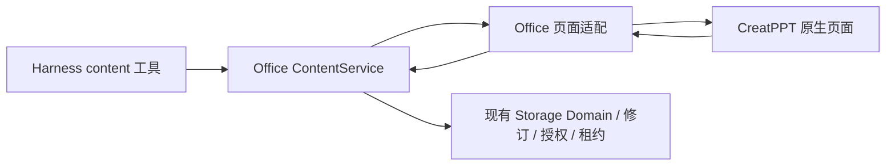

# ADR-0026：Office 的 PPT 采用 CreatPPT 原生编辑器

日期：2026-09-12。状态：选型已由用户确认；产品接入进行中。

## 需求与决定

用户已在 19091 独立页面体验并确认 CreatPPT，要求在 开物Praxis 内体验，AI 创建后右侧打开，每次提交实时显示，保留原生编辑、保存和 PPTX 下载。Word 暂停扩展。

只使用 @seekskyworld/creatppt 0.1.4（Apache-2.0）的已发布包。公共根入口的 DeckSpec/parseDeck/deckFromBrief/ensureDeckElements/rebuildSlideElements 为唯一 PPT 模型及布局算法。此前自建 Konva/PptxGenJS 模型仅保留探针，不进入新产品路径；不引入 PPTist，不映射双模型。

## 官方能力复用记录

任务 PPT-02；Harness 文档为 docs/dsh-v0.1.6-alpha.2 的 tools/Connection/Client sidebar 公开说明，既有 U1 pending/ACK 与 Praxis-office-live Tab 已验证。CreatPPT 发布包公开 exports 仅根领域入口、./dsh、./package.json；根入口提供原生语义和布局，发布包 dist/client 提供原生 Vue 编辑与浏览器导出。19091 为 CLI 独立体验，不能作为集成验收。

不加载 ./dsh：它的 create_presentation/CLI/server 持久化流程与既有 ContentService 重叠。正式插件不启动第二个 HTTP 服务，不建立新 Agent loop、存储或 MCP 传输。使用已有六工具、官方 Connection 与会话定向展示。

## 缺口与最小扩展

0.1.4 原生页面只在 mounted 时 GET /api/deck，修改后 PUT /api/deck；没有公开 mount/applySnapshot API。它在加载时重建未编辑的生成元素，保留 userEdited 的人工修改。必须实测人工修改保存、重开及导出，不能只验证生成 JSON。

首步建立薄领域适配：直接使用原生 DeckSpec，明确的生成/插页/改页/删页操作，不重新实现几何和布局。解析、总大小和 ID 唯一性在写入前校验，失败保持原输入不变。下一步由现有 ContentService 接管身份、CAS、幂等、租约，页面接同一路径；原生资源与通信桥仅装配编辑器，不能另存事实。未完成授权/并发及卸载验收之前，PPT 菜单仍标待接入。

## 取舍、失败与验收

采用现成编辑器减少自建工具栏、拖拽和导出代码。代价是发布包尚无嵌入刷新接口，需要最小页面装配；不能通过修改压缩的 Vue 私有实现实现刷新，也不能在人工编辑时整页重载覆盖本地修改。用户租约期间 AI 提交沿用冲突反馈。

资源必须经过授权且可离线保存；相对资产路径、远程 URL 暂不成为可移植工作副本。领域 JSON 大小、幻灯片数、元素数受限；重复 ID 和跨类型操作明确失败。

验收依次为原生编辑/重开/PPTX 下载，统一服务授权/CAS/租约，AI 创建自动打开/逐次同步，插件制品安装卸载重装。通过某一步不代表全部完成。Word 回归继续保留，公开 alpha.2 不变。

2026-09-12 U2：以上应用自动打开/修订同步、统一授权/CAS/租约、原生人工保存/下载/刷新重开已通过。真实模型普通请求及带PPT全局技能的新任务均通过，不新增场景特定提示。旧会话回放、PPT制品全生命周期及许可发布审查仍待验收，见 evidence/office-creatppt-u2.md。

2026-09-12 用户明确PPT默认直接编辑，不要编辑租约/模式按钮。PPT页面不再acquire/renew/release租约；人工Connection仍走既有editHuman/commit，可信Session/授权/审计/幂等/CAS全部保留，Word租约规则不变。未保存人工输入期间不重载iframe；冲突保留本地缓冲并显示错误，不盲目重放覆盖。中文原生“打开第 N 页”按钮纳入就绪/跟随，GET快照加载后才确认就绪，浏览和全屏导航不禁用整张iframe。

### 逐页制作契约
AI 每次内容提交最多影响一张幻灯片；结构操作可以原子批处理。新建只初始化第一页，后续通过原生语义操作逐页完成。宿主保存正在制作的 slide ID，页面优先按该 ID 选择，避免模板归一化影响封面导致错误跳转。手动编辑的原生整稿保存不受该限制。此约束适用于所有 PPT 请求，不匹配业务关键词。
