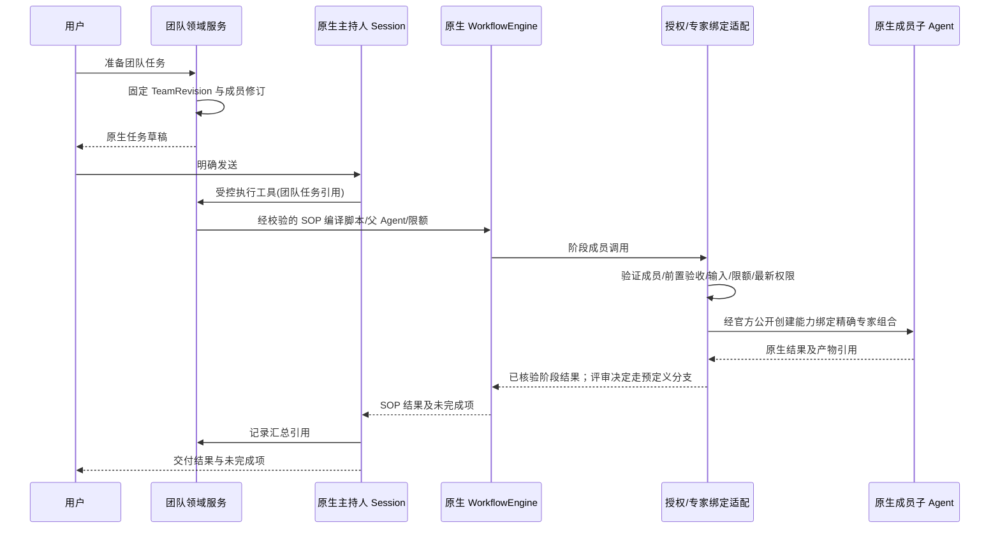
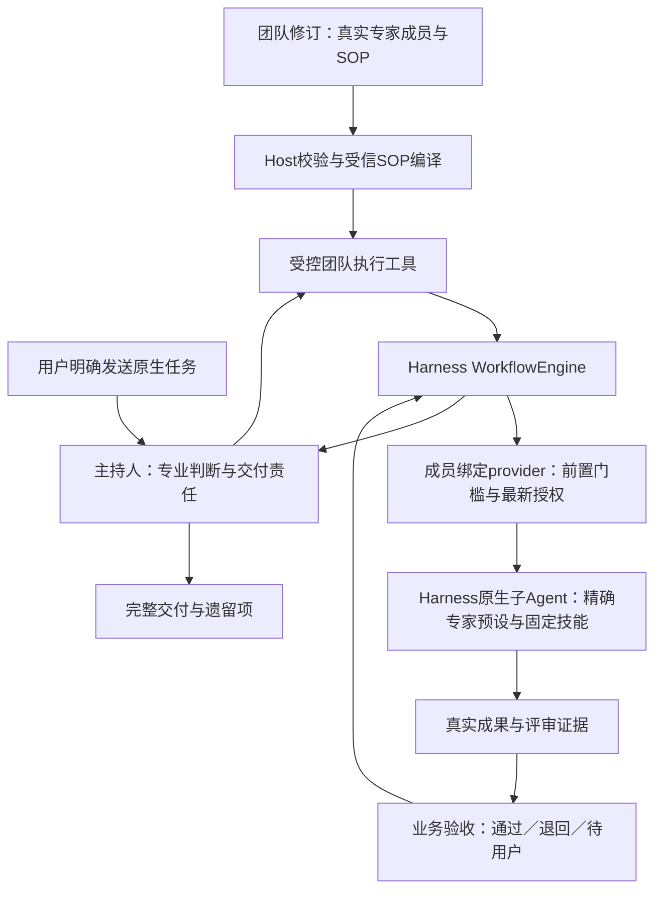

# 专家团技术方案（D11，运行尚未验收）

2026-09-13 实测更新：默认Agent Teams缺精确成员preset接点；独立one-shot最小适配、第三批有限SOP及第五批运行接入（one-shot适配迁入专家插件正式生命周期、六项AI可调用委派工具、签收/交接/交付三闸门，`--team`退出0/7项检查全过）均已通过，第四批目标Profile组合与真实文件版本回执也已通过。指定评审/当前正文版本/依赖准入/有限返工/取消撤销/受测工具绕行/交付同字节均有真实原生证据。详见[TM-01证据](../../evidence/expert-team-tm01.md)。完整生产Profile安装、团队页面与付费模型未执行，不把隔离探针签收为专家团上线；TM-01整体退出等待用户验收。

**当前实施入口：[TEAM-IMPLEMENTATION-HANDOFF](TEAM-IMPLEMENTATION-HANDOFF.md)。**下文保留设计演进与接口调查；其中 workflow/one-shot 的流程图和固定路线均为候选分析，不再作为首版唯一方案。具体范围、字段、限额、开发顺序及交接要求以实施入口为准；TM-01 实测后补入选定运行契约。

基线：PRD-EXPERTS-001 1.1；需求 REQ-TEAM-001～006。

2026-09-13 最新复核：术语和运行接点见第11节；新提供的 WorkBuddy 目录、一句话创建整团及官方同版本 Agent Teams 核对见第12节。首版需要 SOP；是否采用 Agent Teams 或 workflow 执行由 TM-01 对比证据决定，不预先排除已发布的官方团队底座。

本文件说明用户参考图中的“专家团”，供后续开发交接。团队属于专家插件的后续功能；不能因为有详情页和成员头像就宣称实现了多代理。当前 D04 发布不会开放团队召唤。

## 1. 产品模型

专家团是多位真实专家加 SOP 编排，不是成员头像合集或单模型扮演多个角色。发布修订固定一组成员、唯一主持人、工作分工、SOP 阶段及依赖、输入输出/评审、交付汇总规则和资源限制。成员引用已发布的 ExpertRevision，而不是可变的“最新版”别名。专家身份与组织成员身份分开；一个真实用户使用团队不意味着每个虚拟专家都有一个企业账号。

默认软件交付团队可以使用本产品原创角色：交付负责人（主持）、需求分析、架构设计、实现、测试评审。角色描述和示例自有，不使用参考图的人名、头像或案例。至少 2 个成员，建议上限 8；默认并发 3、最大深度 1（当前不允许团队再召唤团队）。这些是建议运行限制，不是 Harness 官方默认值。

| 领域对象 | 数据和约束 |
|---|---|
| ExpertTeam | 稳定 id、owner、origin、availability、draft/published refs；与 Expert 相同治理 |
| TeamRevision | name/description/avatar/tags/examples、members、leadMemberId、mode、sop、coordinationPolicy、limits、digest；发布后不可修改 |
| TeamMember | 稳定 memberId、role、expertRevisionRef、responsibility、inputPolicy、outputContract、required；角色名非身份凭据 |
| SOPStage（拟定义） | stageId、负责成员、dependsOn、输入/输出要求、并行条件、验收/反馈规则；进入 TeamRevision，具体 wire schema 开发前审定 |
| TeamRunBinding | teamExecutionId（一次业务执行）、teamRevisionRef、leadSessionId、发起 actorRef、workspaceRef、operationId、关联 nativeWorkflowRunIds 与成员委派引用；不与原生 runId 混用 |
| DelegationRecord | delegationId、stageId、memberId、inputSummaryRef、授权判定 ref、nativeChildRef、attempt、结果/产物引用；continuable 路径另关联实际 messageId/回合证据 |
| TeamSummary | 成功项、失败项、未执行项、冲突项、证据引用；不能编造不存在的成员产物 |

主持人也绑定真实 ExpertRevision。模板发布前验证角色唯一、主持人存在、没有重复 memberId/循环依赖、成员已发布可用、资源限额合法、必需依赖已满足。

## 2. 执行方式的选择（2026-09-12修订，提议）

| 模式 | 用途 | 官方依托 | 产品约束 |
|---|---|---|---|
| SOP 内受控分工（固定阶段候选） | 固定业务阶段；主持人提供专业判断，流程约束顺序、并行、评审与返工 | 官方 WorkflowEngine + 原生 subagent；受信 SOP 编译与成员绑定适配 | 与官方 Agent Teams 路线对比后选择；精确专家组合、业务门槛和持久事件适配须通过 TM-01 |
| 通用 workflow 配置（后续增量） | 在首版 SOP 基础上提供更广泛的流程配置与复用 | 官方 workflow + 原生 subagent | 不将任意导入 JavaScript 当安全工作流；业务计划经受信编译/适配；不是自造通用引擎 |
| 官方 Agent Teams（优先评估） | 命名成员、多轮交接、持久消息、共享任务依赖 | dsh-experimental-agent-team 与 dsh-experimental-tool-agent-team 均已发布0.1.5-rc.1，当前项目未安装 | 先验证同版本装配、专家修订绑定和SOP门槛；实验性稳定性、恢复边界按实际证据评估，不仅因未安装而排除 |

优先交付包含 SOP 阶段与依赖的真实闭环；如锁定 subagent provider 不能限制成员能力/身份，不可用简单的 prompt 约定代替强制边界。首版 SOP 不能省略，但通用流程设计器/任意 workflow 编辑属于后续；当前团队运行未实现，二者都不能写成已有能力。团队插件不直接 `new Worker`/fork 进程来规避官方执行所有权。

## 3. 从召唤到执行（workflow 候选路径）

领域委派适配对外只接收 memberId、结构化任务和已授权资料引用；Host 解析该成员对应的 expert/preset。不能允许模型提交任意 preset/npm 配置或 tool allowlist。

默认 fresh 子上下文，输入最少必要任务摘要、产物引用与受权文件。fork 必须作为显式策略验证，避免复制主持人的全部历史。锁定版 `composeFrom(agentCtx, parentCtx)` 继承父 Agent 的同一组合，并不能传专家 id 切换成员身份；指定专家候选路径是在官方 Agent 创建的 setup 中用公开 `agentPresets.mount(agentCtx, presetId)`。原生 spawn 的 start request 没有 preset 字段，不能假定加上 persona 就完成成员精确绑定。具体 provider 适配必须先验证，且组合不代表业务授权；每个子任务必须创建自己的受控绑定，动态重新解析发起主体的最新权限。

上图的 workflow 是一段无需主持人中途判断的执行。需要主持人评审或用户补充时，先结束该段并返回成果与待处理项，再由主持人的下一原生步骤处理；后续段继续引用同一 TeamRevision、已验收成果和剩余额度。指定独立评审成员可在段内执行，但不能让正在等待工具返回的主持人又被该工具等待，也不创建主持人的副本来绕过此限制。

每个委派有稳定 delegationId；同一次重试不能重复执行外部操作。实际执行仍由官方 subagent 管理，领域只记录映射/预算/状态引用。跨 Agent 写同一目录时需隔离工作路径或明确串行写阶段；`writeScopes` 是提示，不是文件锁或沙箱隔离证明。

## 4. 状态与恢复

Agent 活跃/停止状态来自原生事实，不建立另一个 Agent 状态机。SOP 的待验收/通过/退回属于必须持久化的业务事实；由领域服务依据真实结果和验收证据写入，不能从 turn/end=completed 自动推出通过。团队 UI 合并两类事实显示。

| UI 状态 | 判定 | 允许操作 |
|---|---|---|
| preparing | 已有计划、成员尚未激活 | 取消准备 |
| running | 主持人或成员原生 run 活跃 | 看子任务、取消 |
| waiting-user | 原生审批/问题阻塞 | 回答/审批/取消，不能由主持人替用户批准 |
| completed | 所有必需阶段验收通过，汇总交付经核验，所有已启动成员已终止 | 查看交付、准备新任务 |
| partial | 有可用结果且部分成员失败/被跳过；所有已启动成员已确认终止 | 看失败与结果、明确重试失败项 |
| failed | 无有效交付且运行已结束 | 诊断、准备受控重试 |
| cancelling | 已请求取消，尚未确认全部停止 | 持续跟随原生状态 |
| cancelled | 所有已启动成员都确认停止 | 查看已产生结果 |
| quiescenceUnknown | 断连/超时无法证明某成员停止 | 明确未知，禁止自动重跑有副作用步骤 |

单个成员失败是否继续由 required 与 coordinationPolicy 决定；不能仅用 `Promise.all` 拒绝丢掉其他结果。主持人汇总明确“缺哪个结果”及现有产物来源。可选成员失败即使不阻止交付，也必须在摘要列出。

取消：停止新增委派，由实际句柄所有者对本次 workflow 执行 cancel/dispose；如未来启用 continuable，按该业务执行记录的子 Session 使用公开 drainContinuableChildren，并核对失败与停稳事实。只有整个父 Agent 拆卸时才考虑 drainContinuableDescendants，不能为取消一个团队任务而停止该父任务的无关子代理。interrupt 仅中断活动，不等于释放成员及后代。框架清理也不能证明外部已提交操作撤销；无法确认时记 quiescenceUnknown。默认30秒是建议 UI 等待阈值，不是进程杀死保证。

重启：读取持久 TeamRunBinding 与 Session 事实，再通过公开 provider 查询/恢复。in-process provider 若不能跨重启恢复活跃句柄，展示 interrupted/unavailable 诊断并映射到 quiescenceUnknown；不得按旧进度自动新建同一外部操作。固定流程只可从确认已完成的检查点继续；检查点和幂等能力必须真实实现后才开放按钮。

## 5. 团队治理和编辑

定义发布沿用专家的草稿、校验、确认、不可变修订和幂等操作。成员更新先产生新 TeamRevision，旧 TeamRunBinding 不随之变更。任一必需成员被停用/撤权时，新执行拒绝；活跃任务停止新委派，在下一受控边界重新授权并标明受影响成员。

团队角色不扩大用户权限；每个 Skill、文件、连接器的使用仍有各自授权与 Harness 审批。不能把一个成员的个人连接凭据传播给另一个成员。当前可信本地执行不能宣传为企业跨用户隔离。

默认团队只读可复制。团队创建引导未来使用独立管理入口或 expert-manager 的受控 team 模式，不通过在个人专家提示词里写“你有五名成员”代替结构化 TeamRevision。

## 6. 团队交付包（后续有限范围）

1. TM-01：锁定版 workflow/subagent 公开面探针：指定专家完整组合、受信阶段调用与越权拒绝、输出门槛、取消/dispose、原生持久呈现事件。先证明链路，不升级、不另造运行器。
2. TM-02：团队 DTO、SOP、草稿/发布服务、成员/主持人/阶段依赖/输入输出校验，复用专家修订。
3. TM-03：SOP 内真实委派与原生事实映射、阶段门槛和并行、输入输出交接/评审反馈，限制并发/深度，产物汇总。
4. TM-04：详情、成员状态、失败和取消 UI，重启/卸载/权限变化验收。

TM-04 后即完成该团队范围。通用 workflow 设计器、实验性 agent-team 和企业分发不是该范围完成的隐性前置；必要 SOP 不在此排除范围；如计划新增，另行批准明确范围。

## 7. 使用与制作旅程补充

使用详情展示专业目标、成员职责及唯一主持人、SOP 概要、真实示例与预期交付，再提供召唤。成员详细经验与技能可查看；技术修订摘要次级呈现。制作团队依次选择目标→已发布成员及职责→主持人→SOP 阶段/先后与并行/输入输出/评审反馈→预览→校验→确认发布；不得仅在专家提示词写“请成立团队”。团队编辑能力 TM-02 实现前不开放假管理入口。

软件交付场景采用原创成员：主持人、需求、架构、实现、测试。需求确认后，架构设计与测试验收设计可并行；实现使用已确认设计，测试发现问题反馈修改；主持人核验产物和遗留问题后汇总。用户批准涉及发布/外部写入时沿用原生审批，不由主持人代理授权。失败、缺输入及冲突要进入可见反馈链，不能凭生成最终摘要标记全部成功。

详细顺序、版本及验收映射见 [开发计划](DEVELOPMENT-PLAN.md)。目前 D11 仍为 todo，所有 SOP DTO 与委派接口为拟设计。

## 8. 落地架构：专家执行工作，SOP约束协作

本节保留固定 SOP 使用原生 workflow 的候选设计，尚未实现。2026-09-13第12节与[ADR-0020](../../adr/0020-expert-team-sop-on-native-workflow.md)更新路线选择：首版必须有SOP，但不预先指定唯一执行服务；先评估同版本官方Agent Teams，workflow用于适合的固定执行段。通用设计器仍后置，不调整D04当前任务、D11前置D10或企业后台后置计划。

### 8.1 三层职责

| 层次 | 拥有的职责 | 不允许混淆的边界 |
|---|---|---|
| 专家成员 | 领域经验、分析方法、技能、具体成果；发布修订固定 | 成员不是一段临时角色名字；必须确认真实子 Agent 使用该专家完整组合 |
| SOP领域契约 | 哪位成员做哪一步、接受哪些输入、前置验收、并行条件、成果标准、评审与有界返工 | 业务验收不是 Agent loop 的停止原因；不能由主持人一句“已完成”跳过 |
| 原生运行底座 | Workflow执行脚本、子Agent生命周期、模型/工具执行、审批、取消与资源清理 | 开物Praxis不复制loop、不自己new Worker、不将UI日志当控制句柄 |

主持人可在 workflow 段返回后的原生步骤补充问题、判断质量、提出返工，在声明范围内选择下一分支；段内判断由受信规则或指定的独立评审成员完成。改变必需阶段、成员修订、权限或返工上限属于计划变更，须形成可审阅变更并由受信入口确认；不能模型自行改写发布SOP。审批等待应复用已验证的原生机制；跨用户输入的暂停/恢复衔接未验证前，不宣称workflow worker可无期限持久挂起。

### 8.2 SOP首先是业务数据

建议阶段字段：`stageId / memberId / dependsOn / inputRefs / outputContract / acceptance / reviewer / onReject / maxAttempts`。这些是拟议开物Praxis契约，不是Harness原生参数。前向阶段图无环；返工以有界新attempt记录，不能通过删改原结果让失败消失。一个成员可承担多个阶段，每个阶段/attempt有独立原生任务关联，首版不要求常驻群聊或成员互发邮箱。

发布校验覆盖：成员与主持人存在且可用、修订可解析、输入引用来源、无环、必需交付可达、评审角色、有限返工/总调用预算、并行写冲突。不能只校验JSON形状。自然语言制作可以生成该业务草稿；用户预览的是“谁先做、交接什么、如何验收”，任意脚本不成为导入格式。

### 8.3 固定SOP如何驱动原生workflow

Host只把已校验的TeamRevision编译为受信脚本，使用顺序等待、允许的并行与明确的条件/有界循环。执行工具持有真实父Agent，调用公开 `ctx.workflowEngine.start`，明确provider和总Agent限制，在所有完成/错误/取消路径释放run。脚本的 `phase()` 和 `meta.phases` 只是显示注释；**不会自动强制阶段依赖**。前置条件由编译控制流和Host业务门槛共同约束。

脚本调用须映射已授权成员和stage/attempt，Host从任务绑定解析精确预设；不允许任意preset、npm配置、模型路由或工具授权。具体调用封装与一次性调用凭据的传递方式在TM-01确定，普通label或prompt里的角色名不能作为授权依据。成员和主持人的通用委派入口也须检查，避免绕过SOP创建未声明任务。

**公开面核对（锁定0.1.5-rc.1，声明检查完成，运行探针未做）：**

- workflow与worker-thread发布包已在当前依赖中；安装存在不等于目标Profile已激活。公开WorkflowStartRequest提供script/meta/args、真实parent、signal、subagentProvider和maxTotalAgents；不会自动理解TeamRevision。
- SubagentStartRequest提供prompt、parent、signal及有能力条件的persona/toolFilter/outputSchema等，没有指定专家preset字段。`composeFrom`继承父组合；公开`agentPresets.mount`支持在创建setup中挂指定预设。官方in-process driver的公开入口只接受request及可选fork seed，不能凭空传setup/preset覆盖。
- 因此需先验证通过公开provider与Agent创建/句柄能力，能否在首步前挂精确专家组合、写自己的绑定，同时仍使用原生loop与生命周期。若做不到，记录明确缺口；不得复制driver内部实现或用父预设加persona冒充完整专家。
- `workflow/*`为观察事件。官方tool-workflow有自己的持久Session事件和Conversation呈现；自定义调用engine不保证自动获得这套记录。先查可复用公开入口；必要时通过公开Session扩展事件/Conversation注册做领域投影，不复制私有recorder，不凭UI创建假子任务。

### 8.4 验收与返工必须有依据

成员原生completed只说明运行完成。阶段通过至少核验输出格式、实际文件可读及摘要、输入来源，按成果类型核对测试/对账等证据，再接受指定评审决定。模型说“测试通过”必须有真实测试回执；客观检查失败不能被评审一句“通过”覆盖。跨业务通用框架只管理契约与证据，具体专业检查来自该SOP的受信规则，不在底座硬编码某个行业。

保存`stageId/attempt/inputDigests/outputRefs/nativeChildRef/acceptanceDecision/evidenceRefs`。退回不覆盖前次结果；重做改变输入摘要时，受影响的下游阶段不能沿用旧通过状态。是否允许重试须检查最新权限、原生终止与副作用回执；确认不了外部写入结果时先标明未知。首版不承诺跨重启自动续跑脚本；恢复先诊断，再显式准备经验证可重做的阶段。

### 8.5 软件交付团的真实例子

1. 需求专家输出需求与验收条目；缺核心输入则请求用户补充，不启动后续必需工作。
2. 需求验收后，架构专家与测试专家并行产出架构方案和测试设计，二者使用同一需求版本。
3. 实现专家取得已验收设计和测试标准后开发；实现产物有真实文件/修订引用。
4. 测试专家执行并提交失败/通过证据。失败进入有限实现返工，再测试，耗尽上限明确未通过。
5. 主持人依据所有必需阶段的验收、真实成果和遗留项完成交付；不能靠最后一份摘要宣称整体成功。

并行仅在输入和写入范围可兼容时开放。原生child请求默认cwd来自parent；不同输出路径不等于已实现不同工作区/文件锁。隔离配置尚未验证时共享写操作串行，允许只读设计阶段并行。并发、最大尝试、总子Agent调用和深度均须有限；企业分布式调度、Web后台和组织发布仍留后期，不为首版引入服务器。

### 8.6 首版验收终点与需求覆盖

| 需求 | 必须看到的证据 |
|---|---|
| 专家身份真实 | 两个不同发布专家的真实子Session，各自preset/专业设定/固定Skill不串扰 |
| SOP顺序与交接 | 前置未通过不能启动；下游读取正确版本成果；跳步骤请求明确拒绝 |
| 并行与冲突 | 允许阶段确有重叠运行；共享写冲突被串行或已验证的隔离策略拒绝 |
| 评审与返工 | 一次真实不通过→重做→再验收；失败attempt保留；超限停止 |
| 完整交付 | 必需阶段和真实成果全部核验；部分失败/未执行明确展示 |
| 治理与恢复 | 取消清理、撤权阻断、重复调用、插件服务消失和重启未知状态不造成自动重复写 |

继续沿用TM-01～04四个交付包，不增加隐藏阶段。TM-01先证明官方链路可行；TM-02固定定义/发布；TM-03实现一个完整SOP；TM-04完成界面与失败恢复。当前仅更新方案，没有团队运行代码或验收结果。

官方依据：[Workflow](https://deepseek-harness.github.io/deepseek-harness/reference/subsystems/workflow)、[Subagent](https://deepseek-harness.github.io/deepseek-harness/reference/subsystems/subagent)；本地镜像见docs/dsh-v0.1.6-alpha.2/subsystems/workflow.zh.md与subagent.zh.md。网页、锁定发布声明与未来真实运行证据分开记录。

## 9. 官方子系统复核补充：subagent不能省略（2026-09-12）

本轮按用户指定目录进一步阅读README、subagent、workflow、agent-team、core、session-projection、conversation、session-reference、skills与approval的相关契约；同时对照锁定发布包的公开SubagentRuntime声明。下面是对第8节提议的补充，不是实现证据。

### 9.1 复用路线应按协作类型区分

| 场景 | 优先评估的官方能力 | 需补的领域差异 |
|---|---|---|
| 固定SOP、有限阶段调用 | workflow + one-shot subagent | 团队修订、精确专家绑定、成果交接与业务验收 |
| 同一专家多轮讨论/反馈 | continuable subagent，原生inbox/sendMessage及激活管理 | 确认该路径可保持精确专家组合；关联消息与业务阶段验收 |
| 成员间直接交流、共享任务板 | 实验性Agent Teams：roster、peer mailbox、task blockers | 固定发布成员与专业组合、SOP质量门槛；先核对锁定版本可安装性与兼容性 |

历史候选曾限定固定SOP使用one-shot；当前按TM-01优先评估Agent Teams，未确定运行路线。返工如果需要保持同一成员上下文，应评估continuable，不能直接新造“常驻专家管理器”。Agent Teams已有任务依赖和邮箱，不能把这些当作Harness完全缺失的能力而自行开发另一套通用团队底座。当前lock未检出agent-team包，故不直接作为首版已激活能力；同版本包已发布，不需要仅为评估而升级Harness。

### 9.2 已有能力与约束

- 锁定公开SubagentRuntime已有startContinuable、sendMessage、interrupt、listChildren与listDescendants。可继续子Agent持久Session与进程内Activation分开；原生管理器拥有物化、冷恢复、唯一inbox、父子所有权和释放。不能另做消息队列、Activation registry或轮次循环。
- one-shot的SubagentRun只拥有本次结果与dispose，没有sendMessage/恢复。continuable不通过SubagentRun管理多轮对话，不能把两种句柄强行包装为一套假运行语义。
- sendMessage准入成功只表示消息被接纳，不表示轮次结束或成果合格；准入后的调用方signal取消不会自动取消已接纳工作。interrupt只中断当前活动并保留队列，不自动dispose整个成员及其后代。团队整体停止须复用相应所有者清理契约并核验，不把interrupt返回当“团队全部停止”。
- 普通subagent模型消息只支持直接父子，不支持sibling直接交流。需要peer消息时先评估官方Agent Teams mailbox，或者保持首版经主持人交接，不编造原生sendMessage可任意群聊。
- listChildren/listDescendants是官方发现入口，不会为了列表唤醒子Agent。inactive/running不是阶段验收结果，也不证明可恢复性；团队页面应复用官方事实并叠加自己业务验收，不再扫描目录构建另一套子任务目录。
- continuable的prepareContinuable只贡献可选历史seed，**不能通过自定义provider在这里偷偷插入preset/setup创建逻辑**。精确专家绑定必须分别证明one-shot和continuable路径；前者可扩展不代表后者也能同样扩展。冷恢复子Session能力也不代表恢复workflow脚本程序位置或自动重做外部操作。

### 9.3 对适配层的进一步收敛

第8节的“成员绑定provider”是候选公开扩展，不能先假定必须新建。TM-01先验证官方现有consumer/provider配置与创建挂载机制能否直接满足目标，只有确实缺业务差异才增加最小适配。persona是官方有作用域的专业提示机制，适用于其真实支持范围；问题在于它本身不保证另一个完整专家preset及固定Skill组合，不能仅因用了persona就否认真实Agent，也不能据此冒充完整专家绑定。

团队阶段状态优先由Host通过官方sessionProjections注册纯折叠单元；框架驱动与传送完整快照，Client只渲染，不另开日志流或在浏览器重算权威状态。Conversation扩展走官方Event/View Definition。业务定义/修订复用Storage域；资料引用先核对官方SessionReference/FileReference能力，但显示label和引用本身均不授予访问权。Skill按原生Host/scope目录和发布固定依赖适配读取，不给每位成员复制一套技能管理器。人工许可继续复用approval，专业主持人不能代理用户权限。

### 9.4 TM-01补充交付要求

保留原四包计划，只细化TM-01，不新增产品阶段：

1. 出具one-shot、continuable、实验性Agent Teams三条路线的锁定版本exports/类型/装配矩阵；明确哪些已可直接复用、哪些未安装、哪些存在业务缺口。
2. 验证两个不同专家的专业设定/固定技能与任务绑定，在首次运行和可支持的恢复入口均一致；分别验证continuable是否能满足精确组合，不从one-shot结果推断。
3. 验证父子消息准入与结束区别、冷列表不唤醒、interrupt与整体清理区别、取消副作用未知状态；复用原生事实和Session projection。
4. 得出有限推荐及失败依据，再决定是否需要最小公开适配。未通过前不提交自建团队调度器、消息系统或通用Agent管理服务。

官方链接：[Subagent](https://deepseek-harness.github.io/deepseek-harness/reference/subsystems/subagent)；本地对照目录为docs/dsh-v0.1.6-alpha.2/subsystems。实验性Agent Teams的可用性须另做包版本核对，本轮仅阅读文档及检查当前lock，没有安装、升级或执行真实团队探针。

## 10. 下一步专家团规划（2026-09-13）

本轮按用户“下一步规划专家团”收敛产品和开发交接，仅规划，不启动团队代码、安装或真实模型调用。已有 TM-01～04 和 AT-T01～T07 继续作为唯一实施/验收索引，不另开一套团队项目。D11 仍 todo，development-order 的 D10 前置未调整；若下一轮要求优先实施专家团，应先同步主线顺序与依赖裁剪。

### 10.1 WorkBuddy 参考的取舍

已读本机 expert-manager/SKILL.md 与 references/team-spec.md。参考的是创建和协作体验，未执行其脚本，也未复制第三方角色、提示词全文或注册机制。

| 参考做法 | 开物Praxis 采用方式 |
|---|---|
| 先明确目标、成员职责、主理人和 SOP | 支持自然语言创建及资料转化，先生成可审阅草稿；可复用已有专家，也可按用户“创建整团”的请求同时生成成员草稿，不要求预先手工建好所有成员；不自动执行业务任务 |
| 成员独立产出，不能主持人代写 | 各阶段绑定真实专家修订和原生子任务；主持人汇编必须引用这些产物，缺产物不能生成假成员结论 |
| 前阶段回传后再启动下阶段 | SOP 保存依赖与成果版本；Host 校验前置验收，选定的原生协作底座承担实际执行 |
| 信息经主理人中转 | 首版保持主持人协调、受控成果引用交接，不要求成员群聊；不将完整历史和凭据复制给所有成员 |
| 每阶段通报进度 | 展示实际原生任务与业务阶段进度，不用模型旁白推断成功 |
| TeamCreate、Agent ID、settings.json 等约定 | 属于 WorkBuddy 平台契约；不冒充 Harness API，不沿用其目录、Python 注册脚本或每角色插件包 |
| 花名、固定标签数、统一头像 | 名称与职能分开、头像风格可一致；不强制花名/标签数，也不让装饰性内容阻断协作 |

### 10.2 首版用户闭环

1. **创建**：专家中心区分单专家与专家团。用户描述共同目标、成员角色、经验和交付；可以组合已有专家，也可以同时生成所缺成员的专业草稿。发布时成员须解析为已发布修订，并有唯一主持人。对话生成草稿与手工编辑使用同一个 Experts Host 服务。
2. **制定流程**：展示阶段卡片，明确谁做、依赖哪个阶段、收到什么、交付什么、谁评审和失败如何处理。首版采用有限阶段模板，不提供任意脚本或通用可视化流程设计器。
3. **预览发布**：使用详情展示目标、成员、配备技能、流程摘要和预期交付。校验后由受信 UI 明确发布；发布冻结团队、专家与技能引用，不让模型自行发布。
4. **使用**：召唤准备原生任务草稿，用户明确发送。执行前检查成员可用性、权限与必要输入；不把创建团队等同已执行团队任务。
5. **跟随**：对话显示阶段摘要，可展开真实成员子任务与成果。待用户回答、成员失败、评审退回、取消中和停止状态未知分别呈现；不会用一个长期旋转的总任务掩盖阻塞。
6. **交付**：主持人提供一份汇总及真实文件，通过已有原生文件交付入口输出。HTML/Word/PPT/PDF 成果复用各自工作副本展示与导出链路；本阶段不重做编辑器。汇总列出已完成、未完成、冲突和来源。

参与人数、并发和返工次数必须有限；第1节上限是建议，最终数值在 TM-01 资源探针后确认。首版共享目录的写入阶段串行，独立只读分析可并行；不同文件名不构成隔离证明。

### 10.3 最小工程增量与前置验证

团队仍由 packages/plugins/experts 拥有：定义/修订、草稿校验发布、任务绑定和成果验收。复用现有专家选择、冻结技能引用、授权/CAS/幂等、公共 UI、原生 Session 与文件交付。初期输入使用当前任务明确提供的文件和工作区，不依赖尚未接入的资料库或连接器；组织跨用户执行与企业部署不在首版。

**下一项先做 TM-01，而不是先做团队页面。**针对锁定 Harness 发布包验证：两个不同专家的完整预设/固定技能是否可分别进入真实原生子任务；workflow 是否能关联阶段结果；原生取消、列表与断连事实是否足够。one-shot、continuable 与实验性 Agent Teams 分别记录安装/公开契约/运行证据，不从类型声明推断执行通过。

TM-01 输出能力矩阵、有限探针与推荐路径。有公开能力缺口就明确阻断并提出最小适配方案，不修改 upstream、不复制 driver、不新建调度循环/消息队列；未经授权不升级 Harness。当前本文仍只是方案，尚无 TM-01 运行通过证据。

设计复核补充：TM-01 同时覆盖已有专家 pre-step 守卫下的子 Session 绑定、主持人评审返回边界、团队局部取消和 one-shot/continuable 的分别验证，见第11节。不能把普通单专家会话创建改名为原生子代理。

### 10.4 四包实施与验收终点

| 顺序 | 实际工作 | 必须提交的证据 |
|---|---|---|
| TM-01 | 验证官方执行链和成员绑定，选定有限 SOP 路线 | 不同专家组合不串扰，原生父子关系、取消/未知边界；不支持的路径列明 |
| TM-02 | 团队定义、成员选择、流程草稿、预览及受信发布 | AT-T01/T05/T06：成员/主持人/依赖校验、冻结版本、CAS 和旧任务隔离 |
| TM-03 | 顺序/并行执行、成果交接、一次有限退回修改、主持人汇总 | AT-T02/T07：至少两成员实际执行、下游使用正确版本、真实文件与测试回执；失败 attempt 保留 |
| TM-04 | 完整界面与异常路径、取消和重启诊断 | AT-T03/T04 及 T01～T07 收口：撤权阻断、不盲重跑、冲突和部分结果可见；最终包安装与卸载回归 |

先用一个低风险合成软件交付流程验证平台：需求产出后，设计与验收方案只读并行；实现写入串行；测试退回一次后有限修复；主持人输出实际文件和遗留项。测试角色/材料不成为内置公共团队，也不为此制作专用业务 Skill。

验收关注真实成员执行、流程约束、版本交接、权限、故障及文件交付。客观检查失败不能写成通过；专业内容的模型效果另列有限评测与已知限制，不把逐个行业样本修好作为平台开发提交的无限前置，也不宣称团队能保证所有领域结论正确。四包完成即停止本范围；群聊、递归团队、自动定时执行、通用工作流平台和企业分发另行规划。

## 11. 设计复核：专家、子任务与原生执行的对应（2026-09-13）

### 11.1 结论与概念

方向成立，运行设计尚有待验证接点。复用官方 API、已发布单专家和 Skill，并不意味着三者已能直接拼成团队；不能将现阶段文档标为可直接实施的已验证适配。

| 概念 | 含义与对应 |
|---|---|
| 专家 / ExpertRevision | 可复用的专业设定、方法和配备技能；是配置和业务身份，不是一直运行的进程 |
| 主持人 | 团队一次执行的父 Agent / 主 Session，加载选定主持专家修订；用户在此交流、做决定、接收交付 |
| 团员 | 引用已发布专家的成员身份；执行工作时通过经过验证的官方路径加载进独立子 Agent |
| 子任务 / SOP 阶段 | 要做的工作及输入输出、验收要求；不是 subagent 的同义词，也不新建同名 Harness Task 执行器 |
| subagent | 实际执行受委派工作的原生子 Agent；同一专家可执行多个任务，不强制一个专家永久对应一个运行实例 |
| Skill | 专家按需读取和调用的能力指导及资源；Skill 自身不自动成为子 Agent |
| workflow | 驱动一段顺序、并行和条件调用；通过 subagent 执行具体工作，本身不是另一位专家 |
| 官方实验性 Agent Teams | 另一套已定义的原生团队能力，含成员名册、成员消息和共享任务依赖；当前 lock 未安装，不与已验证能力混同 |

固定 SOP 的 one-shot 候选路径中，某成员在阶段1和阶段3工作，可以对应两个子 Session，通过明确成果引用衔接。需要保持同一个成员的多轮对话时评估原生 continuable及官方Agent Teams：同一持久子 Session 可以接受多次消息，其消息ID不等于新的子 Agent，也不能仅按会话停止推断某项任务验收通过。具体选择按第12节与TM-01证据；当前不宣称成员常驻、任意互聊或自动冷续跑已接入。

### 11.2 复核发现与处置

| 优先级 | 原方案接点及影响 | 本轮设计处置 / 仍需证据 |
|---|---|---|
| P1 | 完整专家 preset 不等于子代理 persona。当前普通 in-process 路径 composeFrom 继承父组合；开物Praxis 的 expert pre-step 守卫还会拒绝没有自己 ExecutionBinding 的 wd-exp 子 Session | TM-01 必须证明：精确子组合、子 Session 自身专家与主体绑定在首步前就绪；绑定缺失/版本错误仍拒绝。不能关闭守卫、复用父绑定、只替换名字，或用 createExecution 新开普通会话冒充子代理。公开 provider/Agent setup 是候选，尚未运行验证 |
| P1 | 主持人等待整个 workflow 工具返回时，流程又需要同一主持人作中间判断，存在循环等待风险；官方 engine 的中间子结果也不会自动交给父模型 | 固定 SOP 可分成多段原生 workflow。遇到主持人/用户决策先完成并释放当前段，返回实际成果和待处理理由，再执行下一段；不得等待父 Agent 在未返回的工具内部发起新模型步骤。段内可用独立评审成员。段完成不等于团队业务完成 |
| P2 | memberId、业务子任务、原生 childId 和 runId 未明确区分，重复阶段与返工可能覆盖映射或丢上下文 | 使用 teamExecutionId → stageId/attempt → delegationId → nativeChildRef；另关联每段 nativeWorkflowRunId。固定成员修订，保存每次输入/输出版本。continuable 另记录消息和结果对应证据，不从一次 idle 判定所有任务完成 |
| P2 | 泛称 child cancel/stop 容易把 interrupt 当全部停止，或取消整个父树误伤无关工作 | workflow 按本次真实句柄清理；continuable 优先按记录成员调用公开 drainContinuableChildren。仅在父 Agent 整体拆卸时使用后代 drain。加入同父无关子任务不被取消的验收 |

以上属于设计审查，未复现运行故障；前三者需要 TM-01 探针证明实现路径，不能把文档修订算作运行问题已修复。每段原生 workflow 的总调用上限之外，还要核验同一业务执行跨段的累计调用/返工额度，防止换段重置预算。

### 11.3 复用边界与验收范围

当前单专家编译器挂载冻结 Skill 目录时同时保留 includeDefaultRoots。因此“配备技能固定”表示指定依赖版本固定，不表示这些是成员唯一可见或唯一允许使用的技能。团队应按实际可用目录说明能力；如将来需要成员技能白名单，应另行验证原生可见性和 Host 授权，不能在本次设计中虚称已有强隔离。

首版业务层仅保存团队定义、版本、阶段验收与原生执行引用。运行进度由原生事件/投影呈现，消息与激活复用原生能力。若未来接入官方 Agent Teams，则其名册、消息与 task blockers 直接复用，不再维护一份同职责运行任务板；开物Praxis 继续拥有发布定义与专业成果验收。

验收与权限确认分开：输出形状、文件可读和实际测试回执等自动核验，专业评审由指定成员或主持人执行；无需每阶段都要求用户点击批准。只有缺少必须业务信息、原生权限审批或超出已批准计划才请求用户介入。首个有限测试证明真实协作和正确交付关联，不扩展为所有专业领域的模型效果保证。

### 11.4 本轮依据与验证边界

- 本地官方镜像：docs/dsh-v0.1.6-alpha.2/subsystems/subagent.md、workflow.md、agent-team.md、core.md；在线交叉核对 [Subagent](https://deepseek-harness.github.io/deepseek-harness/reference/subsystems/subagent) 与 [Workflow](https://deepseek-harness.github.io/deepseek-harness/reference/subsystems/workflow)。Agent Teams 在线页本次读取失败，其描述仅按本地官方镜像记录。
- 锁定 0.1.5-rc.1 发布声明：dsh-subagent 根公开 SubagentRuntime/StartRequest/ContinuableStartSpec/Provider；dsh-agent 的 CreateAgentOptions.setup；dsh-agent-presets 的 mount/composeFrom；dsh-workflow 的 WorkflowStartRequest/WorkflowRun；dsh-workflow-worker-thread README。continuable provider 的 CreateSpec 仅提供 seed，没有 preset/setup 钩子，不能从 one-shot 适配推导其可行性。
- 实际 开物Praxis 源码：[专家执行守卫](../../../packages/plugins/experts/src/runtime/execution-guard.ts)、[专家服务](../../../packages/plugins/experts/src/services/experts-manager.ts)、[预设编译](../../../packages/plugins/experts/src/runtime/preset-compiler.ts)。普通专家创建与子代理绑定的生命周期不同，复用业务校验需经过领域公开服务，不能从适配器直接写内部绑定表。
- 本轮未变更运行代码、依赖或 Preview，未运行真实模型或团队探针。设计与公开契约复核完成，团队运行仍待 TM-01。

## 12. WorkBuddy 整团创建与官方 Agent Teams 再核对（2026-09-13）

### 产品创建应同时覆盖两条路径

用户新提供目录为 `/Users/techflag/Downloads/workbuddy`。其中 builtin/skills/expert-manager 的 SKILL.md、team-spec.md、agent-md-spec.md、plugin-json-spec.md 与此前 project/workbuddy 对应四文件逐字节一致；本轮重新核对的是该目录及截图所强调的完整使用旅程，不将市场第三方技能当作腾讯自有设计。

截图的一句话包含团队目标、成员角色、共同专长、用户经验。创建指南应据此提炼各成员的专业方法、适用问题、实际技能、输出要求，以及主持人的场景路由和协作流程。经验进入方法/边界/验收，不只放展示简介；对用户没有提供的资历不虚构。

- **组装已有专家**：选现有发布修订，定义职责与SOP。
- **从需求创建整团**：在同一制作流程生成主持人、成员与团队草稿，复用现有单专家业务服务；用户可审阅、替换和选择已有成员。发布前按依赖顺序验证并发布成员，团队只绑定真实已发布修订。中断保留草稿与各项真实结果，重复操作不重复创建；不伪称跨多个对象发布天然原子化，也不自动回滚用户原有专家。

用户不应先手工创建所有成员才能开始。真实发布成员是使用前约束，不是自然语言制作的门槛。缺Skill明确指出可复用/待配置/需另建，不把生成一个技能名称当已经拥有能力。

agent-md-spec另有重要规则：成员覆盖能独立回答问题的专业域；单一维度问题直接调对应成员，综合性问题才走多人流程。开物Praxis应保留这类触发规则，避免每次简单提问都运行全团。这里的单成员路由与综合SOP要显式定义，不能以“动态路由”跳过该场景的必需阶段。

### Agent Teams 是原生团队协作能力

官方Agent Teams由Lead与可继续子Agent组成，增加名册、持久消息和共享任务依赖；它与subagent是组合关系，而非完全不同的执行引擎。开物Praxis专家团是在此类运行能力上增加可创建/发布的专业成员配置、经验、Skill引用、SOP与成果呈现。官方成员有名字不等于已经绑定开物Praxis专家修订。

本轮纠正“未安装所以后置”的选型依据：正确官方包名是 `@deepseek-ai/dsh-experimental-agent-team` 和 `@deepseek-ai/dsh-experimental-tool-agent-team`；两者的 **0.1.5-rc.1 均可从 npm 查询**，peer范围声明覆盖当前同版本族与Cordis4.0.2。当前lock/bundle/node_modules确实未包含，但同版本评估不要求先升级Harness。按不带experimental的短名查询所得404是包名查询错误，不能当不可发布证据。

已用 `npm pack --ignore-scripts` 将团队服务包下载到临时目录，仅读取发布manifest、根导出声明与公开types。tarball shasum为 `e58573c2bc780adc9bed285719bdee1d306308ee`。`SpawnTeammateRequest`当前仅有name/description/prompt/context/provider/signal，**没有专家preset或自定义setup参数**；精确专家组合和原有pre-step绑定仍是核心验证接点。包存在、peer范围相符都不等于目标组合运行通过。

### 路线决定的修订

TM-01优先评估同版本Agent Teams的公开装配与业务适配，重点是成员修订、原生任务与SOP阶段对应、成果验收、消息/取消恢复。如果可用，直接复用其名册/消息/任务板，不再新建同职责实现。SOP不等于WorkflowEngine；采用Agent Teams时，先核对其原生task blockers是否足够表达阶段依赖，额外的专业验收由开物Praxis管理。

workflow+subagent保留为固定执行段候选；仅当确有需要且生命周期与权限可验证时组合使用，不能默认同时运行两套任务调度。若Agent Teams不能通过公开面绑定专家，记录具体缺口，与one-shot公开扩展比较后再决定。首版要求仍是多位真实专家、SOP和完整交付，不把通用设计器/任意群聊作为隐性前置。

依据：[官方团队包README](https://github.com/deepseek-ai/deepseek-harness/blob/master/packages/experimental/agent-team/README.md)、[官方团队契约](https://github.com/deepseek-ai/deepseek-harness/blob/master/docs/subsystems/agent-team.md)、npm精确版本manifest和tarball公开声明。官网master文档不代替锁定版本证据。本轮未安装进Profile、未修改依赖或运行团队；D11状态与顺序不变。
