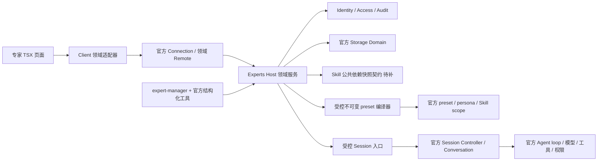
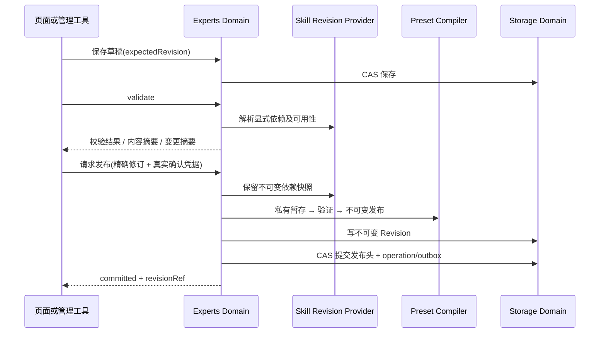

# HLD：专家定义、发布与原生执行绑定

基线：PRD-EXPERTS-001 / 1.1。状态：设计方案；公开适配须通过 G01～G06。原始设计中的服务、修订和绑定已有候选实现；具体公开契约、已验证范围与缺口以 contracts/src/experts.ts、插件 README 和 STATUS 为准，不能将本设计的全部接口当作已有能力。

## 1. 所有权与技术边界

补充前置：[插件交付边界复核](PLUGIN-DELIVERY-REVIEW.md)。专家必须通过官方配置行或 ctx.plugin 建立独立生命周期，并交付可独立安装的组合层；Skill alpha.24 与 bundle alpha.39 已移除这种直接调用 helper 的装配方式；专家继续使用已验证的独立入口与配置层模式。共享编译制品不等于共享运行生命周期，二者分别验证。

开物Praxis 使用 npm 发布的 Harness 包与官方文档，不引入或修改上游源码。保持 Node 22.23.2、pnpm 10.34.5、DSH 0.1.5-rc.1、Cordis 4.0.2 基线。**不要套用相邻 dsh-ssh-desktop 仓库的 Yarn/submodule 规则。**



业务领域保存定义、发布修订、偏好、操作记录、Session 绑定；原生 Session 保存消息、队列、工具调用和执行事实。不得在专家领域另建一套聊天日志、Token stream、模型调度器或执行状态机来覆盖 Harness。

### 拟新增目录

```text
packages/contracts/src/experts.ts             # DTO/错误/接口，无运行依赖
packages/contracts/src/skill-revisions.ts     # 跨域依赖能力，需 Skill owner 实现
packages/plugins/experts/
  src/index.ts                              # 薄 Host 入口
  src/client.ts                             # 薄 Client 入口与 Slots 注册
  src/domain/                               # schema/校验/修订/操作策略
  src/services/                             # 领域服务与治理/存储适配
  src/runtime/                              # preset 编译、健康检查、Session 绑定
  src/transport/                            # Remote 或审定的 Connection 适配
  src/client/{components,hooks,styles}/      # TSX、状态适配、样式
  skills/expert-manager/SKILL.md             # 引导，不能代替领域校验
  templates/                                # 自有只读默认模板
  tests/                                    # 领域、集成、打包界面
```

以上文件拟新增，接口经过发布配置才可导入。不 deep-import 其他插件的 `src`；公共能力通过 contracts 与服务注入。默认模板是专家数据，不是多个 npm 插件。专家团将来在本插件内扩展，不先创建另一个空包。

## 2. 官方复用决策

| 需求 | 复用方式 | 限制/验证 |
|---|---|---|
| 导航和详情 | 官方 `sidebar.panellist`/`main` 对应 key；Praxis-ui Modal | 保留原生 owners；不查 DOM 改样式隐藏 |
| 新任务 | `PraxisSessionAccess.create` → 官方 `sessionController.create` | 请求只有 workspaceId/cwd/sessionId/agentPreset，不存在官方 expertId 参数 |
| 角色 | preset scope 内的 `@deepseek-ai/dsh-persona` | 只能作用域挂载；禁止全局注册；`complete` 固定 false，保留运行上下文 |
| 执行组合 | 官方 preset 发现、copyComposition 与持久 preset ID | 业务修订仍需自行管理；复制后必须受控验证，不接收任意用户 YAML |
| Skill 调用 | 官方分层目录、按需正文、/ 与 skill 工具 | 明确声明依赖由 Skill owner 提供不可变快照，当前需补契约 |
| 内容存储 | `defineDomain`/`domainTable`/`storageDomain.open` | 单记录原子更新；没有跨领域或 Session 事务 |
| 管理工具 | 官方 `defineTool` + tools registry | 与页面使用同一服务；工具不得接受主体/确认布尔值当授权 |
| 草稿填充 | 官方 `conversation.input.overlay` + `inputActions.setDraft` | 目标 Session 一次性交接；保留原草稿 |
| 团队 | 原生 subagent；受控 workflow 作为另一模式 | 实验性 Agent Team 未锁定，不直接依赖最新文档 |

来源与准确适配证据见 [REFERENCES](REFERENCES.md)。官方 `agent-instructions` 用于 AGENTS.md 兼容工作区说明，不拿它冒充专家 persona 服务。

## 3. 领域存储与并发

建议领域 `Praxis_experts`（schema version 1，名称以实际 published `DomainSpec` 验证为准）：

| 数据 | 内容 | 权威策略 |
|---|---|---|
| experts | 稳定 ID、owner、草稿版本、发布头、可用性、操作/outbox 引用 | 同一对象的 CAS 和发布头原子更新 |
| revisions | 完整不可变定义、显式依赖清单与摘要 | 发布后不覆盖；可被多个任务引用 |
| bindings | Session → 专家修订/preset/依赖锁/来源关联 | Task 创建前保留；不可被后续编辑重绑定 |
| preferences | 主体的置顶和最近 | 不写回专家发布版本 |
| operations | 幂等键、请求摘要、状态、结果引用、恢复信息 | 不保存 Token 或凭据；结果可查询 |

默认使用 Profile 的官方存储路由；不由产品包直接打开 SQLite 或手写 JSON 数据库。schema 坏记录不能默默跳过权威数据。`KvTable.update` 内比较 revision 后整体替换，不能先读再无条件 put。进程内必要的创建/跨记录序列由 Host 服务串行化；**这不是分布式锁，本地基线只支持单写 Host。**

快照资源文件由所属领域的资源适配器管理；metadata 仍走官方 Domain。受管文件目录需经官方 home/preset 路径服务解析，不硬编码 `.codex`、`.agents` 或某用户名路径。编译暂存文件可写本插件私有区域，公开前完成摘要与回读。

## 4. 发布流程与确认



- 发布前重新解析当前主体和 `manage` 授权，重新比对草稿及依赖。用户确认绑定 expertId、draftRevision、definitionDigest、dependencyLockDigest、动作、主体与有效期。
- 新 ID 的不可变 preset 先验证再提交发布头，默认模板更新亦生成新版本，不原地覆盖。
- 磁盘构件、Revision、发布头不能假装一个跨系统事务：先写可恢复 operation；失败暂存不被目录发现；未被发布头引用的构件可按操作记录回收；已提交发布头后不因响应丢失报告“未发布”。
- 发布头更新和本对象的提交回执/outbox 放在同一个原子记录变更中。独立 operations 索引可重建；不能只靠两次 put 假定原子。审计事件有稳定 ID，重试不重复追加；汇出失败显示 audit pending，不回滚已提交业务事实。变更前授权/审计服务不可用则拒绝开始。
- 确认凭据由受信 UI 用户动作或官方审批桥生成；不向模型暴露“任意签发确认”的工具。`confirmed: true`、模型转述与提示词均不足。
- 发布不运行专家任务。成功后用户点击“去试试”才进入另一个草稿。

## 5. 不可变角色与 Skill 依赖

### 5.1 preset 编译

领域输入仅允许专业说明、已有能力引用和产品定义的选项。编译器从受信模板生成受控组合；不允许用户/导入包指定 npm 包名、Cordis services、任意配置代码或绝对目录。

每个发布组合生成新的 kebab-case preset ID（例：`wd-exp-<id>-<digest>`，不是官方固定格式）。ID 对应的配置和随附资源只读；内容摘要覆盖实际 bytes、依赖锁、schema/compiler 版本和精确运行包版本。摘要序列化规则见契约，时间戳不参与内容摘要。

persona 挂载仅在该 preset 的 scope，使用官方 prefix/suffix；`complete: false`，不抑制原生工具指导和 runtime context。用户文本中的 `{{…}}` 会涉及官方模板插值，必须通过锁定版本探针确定字面转义方法；未验证前拒绝不受支持的模板表达式并给字段错误，不能借此读取隐藏上下文。基础部署 persona 的保留/叠加规则写成受信编译模板，不擅自覆盖品牌或安全说明。

同一个 preset 的 standing mount 可能被多个 Session 共享；其中只放不可变配置，不存“当前用户”“当前任务草稿”或可变成员状态。

### 5.2 两类 Skill 的明确语义

1. **专家显式声明的依赖**：发布时固定内容与资源摘要，任务使用对应快照。缺失、被停用或摘要变化不能按同名技能静默替代。
2. **原生全局能力池**：未被显式声明的已安装 Skill 继续按官方规则可用，属于动态能力。界面不能声称“全部运行环境完全冻结”；系统权限、模型和外部数据也有各自生命周期。

当前 Skill 服务需新增公共 `resolveRevision/retainRevision/checkRevision/releaseReference` 等价能力，精确命名在契约中提出。专家插件不自己遍历另一个插件的私有目录来制造版本。Skill owner 负责字节一致性、资源读取、归档保留与停用策略；原生 scope provider 负责实际按快照提供内容。

G02 必须证明：A/B 两个 Session 同名 Skill 的目录、正文和资源都隔离；锁定依赖被删/停用时不能回落全局同名实现。若现有 provider 在 load 失败后会回退，适配必须阻断这条调用并拒绝运行，不能仅在 UI 提示。必要适配属于 D04 依赖工作，不重复开发 Skill 0.1 页面，不声称新增公共市场。

## 6. 召唤、模型选择和恢复

### 6.1 创建任务

`prepareExecution` 解析专家固定版本、工作区、模型可用性、当前权限与依赖健康，并创建短期计划；Client 不上传可信 owner/preset 路径。用户确认目标后 `createExecution` 使用独立 operationId，先保留随机且唯一的 SessionId、绑定记录和 owner，再经 `PraxisSessionAccess.create({sessionId, workspaceId, agentPreset})` 创建原生 Session。

原生 create 可幂等采用给定身份，但当前 bridge 拒绝采用未受控的既有 Session；新适配必须检验 operation 的所有者、请求摘要及 preset，绝不按客户端任意 sessionId 接管旧会话。创建请求不支持 AbortSignal，故超时/取消只能标结果待确认，使用 inspect 对账；不能承诺已撤销创建。

创建返回后走原生模型选择能力，保留用户当前明确设置；不支持的显式模型/推理强度返回错误，不私自回退。配置失败时保留可恢复的空 Session 和 operation，修复后复用原身份，禁止自动发送。完成后才交接 draft；这仍不是业务执行完成。

草稿交接保存 `handoffId + sessionId + expectedDraftVersion + text + expiry`，Client 在正确 Session 且原草稿未变化时应用一次。导航失败/组件未就绪可重试同一 handoff；内容敏感，仅存必要短期状态，不同步到日志。新任务普通调用可无示例文本，由用户输入。

### 6.2 冷恢复与旁路

绑定不可变只是数据记录，必须在真实执行前检查：发布构件、声明 Skill 快照、最新停用/授权、模型/服务可用性。检查不得激活另一个任务或泄漏正文。

**关键关卡 G03：** 验证官方原生 prompt/resume、空会话 preset selection、fork、重新加载页面及重启后的入口。仅调用 `PraxisSessionAccess.resolveAgent` 的自定义按钮不保护直接走原生 Remote 的路径。

首选通过官方公开 scope/生命周期 seam 挂载本插件的绑定验证器，让所有绑定 Session 首次提示词及每轮执行前验证绑定；未绑定原生任务保持默认。准确 hook 和拦截时序必须以 published types + Host 探针记录，不在本文虚构官方方法。官方原生 fork 必须通过受支持 seam 继承并校验原绑定，或对该受管 Session 明确拒绝该操作，不能产生无绑定可执行副本。

若 rc.1 无公开 seam 保证上述要求：G03 不通过，D04 不能以“可恢复版本锁定”验收；提交兼容性决策及可复现缺口，不改上游、不绕过原生权限，也不把“建议从我们的按钮进入”当保护。允许继续完成管理与界面供审阅，但不能标单专家 0.1 完成。

### 6.3 交接

原任务有内容后换专家使用 `prepareHandoff`：固定源 Session 与可引用事件位置，用户审阅摘要和资料，目标创建新的绑定。明确哪些材料未授权/不可用。摘要不是指令授权，不直接复制连接 Token、工具输出全部内容或完整隐藏上下文。原任务状态不改；新任务链接原任务；旧任务仍可单独操作。

## 7. 传输与生命周期

外部插件优先官方 Typert Remote：新增专家命名空间，request/response 有运行时 schema、typed domain errors，所有耗时方法带取消语义。前端只消费自己的领域适配器。

当前 Skill 的 exact Fetch 是已有特定兼容路径，不可直接给其他插件套一个无限 RPC 总线。EP-01 对专家先做最小 Typert 生成/打包/认证/取消探针；若仍复现版本问题，以独立 ADR/evidence 审定**官方 Connection 的专家专属 exact Fetch 路由**作为本地例外。两种实现共享同一 DTO/service，最终只启用一种。禁止新 WebSocket、全局 window RPC、绕过 Connection 的未认证端口，禁止升级 DSH 解决单个入口。

取消区分：读取可中止；草稿提交前可取消；发布提交点之后返回已提交事实；原生 Session 创建若无法取消则查询结果。requestId 用于追踪，operationId 用于持久幂等，二者不能混用。客户端可重试读取，修改只在同一 operationId 和相同 payloadDigest 下重试。

所有订阅、Slots、tools、定时器、资源引用和打开的 Domain 由 Cordis inject/effect/disposer 管理。卸载先拒绝新修改、排空已接收提交，再关闭存储；不得用无界后台任务维持专家插件。

## 8. 数据和部署边界

当前是可信本地单用户 Host。所有 API 与工具仍经 Host 身份与资源授权；没有实现企业完整入口治理之前不得暴露为多用户服务。专家角色的专业“权限说明”只是内容，不能改变审批、工具授权、连接 owner 或 sandbox。

普通头像优先受管本地 PNG/JPEG/WebP；不自动加载任意外链追踪图片，不执行 SVG/HTML。Markdown 不允许脚本；外链明确跳转。导入的角色正文是待用户审阅内容，不能影响安装或发布协议。

专家仅保存资料/连接的引用要求，不保存凭据。当前这些领域不可用时不生成假的满足状态。企业端将来替换主体提供方和分发目录适配器，定义与任务绑定模型保留；多用户强隔离、SSO、组织目录和管理 Web 不在本阶段建设。

## 9. 主要取舍

| 决策 | 选择理由 | 放弃的做法 |
|---|---|---|
| 专家独立业务定义 → 原生 preset | 保留用户管理语义与官方运行组合 | 把专家当 npm 插件，或仅每次插入文本 |
| 不可变发布与任务引用 | 历史可解释、更新不漂移 | 同名 preset 原地改写 |
| Host 同一领域服务 | 页面与 Agent 一致，易审计与恢复 | 工具直接写 JSON/页面自己拼路径 |
| 原生 Persona/Session/Skill | 保留 Harness 能力与升级边界 | 重写聊天框、Agent loop 或技能解释器 |
| 本地有限闭环 | 可交付且可验收 | 借专家需求提前建设完整企业平台 |

决策记录为 [ADR-0017](../../adr/0017-expert-definition-and-runtime-binding.md)，探针未过的部分仍是拟议方案。

## 12. PRD 1.1 适配约束

专业经验、判断标准与追问先审查当前 ExpertDefinition 的 role/methodology/boundaries/deliverables 内容及 persona 编译，不为体现“专家”而引入第二套执行器。确需新结构化字段时，统一更新公开契约/schema、草稿/发布、摘要、导入导出、迁移和测试。详情的擅长领域来自明确专业内容/标签，不能自动宣称数据访问或工具能力。

技能选择使用公开 PraxisSkills 目录与管理能力，Client 显示名称/简介/状态，Host 解析稳定 skillId 和冻结修订。不得导入 Skills 内部实现或直接读表；引用移除不卸载共享技能。配置技能清单与官方动态全局发现范围分开展示；实际调用仍由官方 Skill 执行和 Agent Loop 所有。

自然语言创建与编辑器调用同一 Host 服务，专业内容预览是展示投影而非另一状态真源。冻结绑定的官方 Loop 集成已验证部分配置行；完整安装态 preset Loader 及远程模型交付仍待 AT-27，不能混用证据。

团队 SOP 是不可变业务约束与原生委派关联，运行事实仍由 Harness 所有。首次实现前查锁定版公开 subagent/workflow、成员精确组合、阶段约束、身份和取消能力；未验证接口标候选。必要 SOP 不等于自造通用流程引擎，具体分工与阶段合法性在受控委派入口验证。详见 EXPERT-TEAMS 与 DEVELOPMENT-PLAN。
