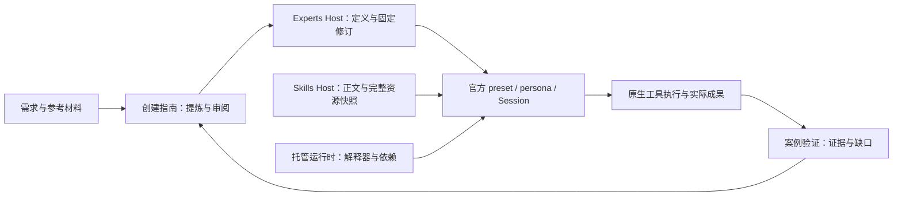

# 专家需求与技术复核：采用 WorkBuddy 的专业方法

日期：2026-09-13。状态：设计补充，不是新功能完成声明。沿用 PRD 1.1、D04 A～E 和 ADR-0017/0018；不新建执行器，不提前实施 D11。

## 1. 结论和证据边界

专家应交付可重复使用的专业工作方法：识别用户场景，核对输入，依据证据判断，调用实际能力，形成可核验成果。角色名称、技能数量、提示词长度都不能证明专业能力。WorkBuddy 值得参考的是这些环节之间的连接。

本次对照本机 WorkBuddy expert-manager 的入口、agent-md-spec 和 plugin-json-spec，以及 tencent-docx 中 work-report-expert 的场景与输出规则、stock-research-report-expert 的 structure_contract。后者是插件中的专业 Skill 材料，不应与 expert-manager 生成的 Agent 包混称。此前完整创建链审查见 [提示词与参考深度分析](../WORKBUDDY-CREATION-PROMPTS-DEEP-ANALYSIS.md)。本机文件不证明所有发行版本行为，也不证明其效果普遍优于其他实现。

原始材料位于 `/Users/techflag/project/workbuddy/plugins/marketplaces/workbuddy-builtin/`，重点相对路径：

- `skills/expert-manager/SKILL.md`、`references/agent-md-spec.md`、`references/plugin-json-spec.md`。
- `builtin-plugins/tencent-docx/experts/work-report-expert/SKILL.md`。
- `builtin-plugins/tencent-docx/experts/stock-research-report-expert/references/structure_contract.md`。

采用专业方法并不表示可以直接再发行全部第三方内容；复制资源前仍需按文件来源核对许可。这里新增的是适配设计，没有复制原包或安装脚本。

## 2. 从原版材料得到的具体要求

| 观察 | 开物Praxis 需求 | 不应照搬的部分 |
|---|---|---|
| 创建支持对话、材料转化、编辑；修改保留稳定身份 | 用户给 SOP/报告/提示词后先提炼已有经验；展示关键修改，不反复问已知信息 | 原宿主固定目录、注册脚本和包结构 |
| 职业定位与昵称、简介、启动问题分别设计 | 详情先说明适用问题、要准备什么、会得到什么；示例能直接启动任务 | 固定三个标签、40～50 字、为满足字段虚构身份 |
| 工作报告按周报、项目、晋升等场景分流 | 按读者、目的、证据和成果选择方法；不让所有请求走同一模板 | 假设每个任务都需要长报告或多轮澄清 |
| 专业参考给章节契约、证据要求、好坏表达示例 | 方法包含判断尺度和反例；输出规定必要内容与检查方式 | “多年名企经验”等无事实依据的履历 |
| 复杂知识与执行材料分离 | 简短入口指定何时读取哪个参考；脚本和模板由技能管理 | 把所有 refs 拼进每次 persona，或只留下无效路径 |
| 团队有主持人、成员职责及 SOP | 后续团队保留真实委派与成果交接要求 | 在当前单专家中模拟多人发言、照抄宿主工具名 |

## 3. 产品需求：围绕一次真实使用闭环

创建时先获得“要处理的问题、典型输入、判断方法、预期成果”。有材料就转换，没有材料可先提出通用方法供审阅，明确哪些是建议。只追问会改变结论或执行范围的信息。专家创建指南与专家执行定义是两层：前者帮助用户定义方法，后者在业务任务中执行；创建过程不能假装已完成业务试用。

使用详情应依次呈现：

1. **适合解决什么问题**：场景、适用范围、不适用条件。
2. **开始前准备什么**：文件、必要字段、可选材料；缺失时可交付到哪一步。
3. **会怎样处理**：关键分析路径和判断依据，允许展开查看完整方法。
4. **会交付什么**：报告/文件/计算结果，以及能检查的标准。
5. **能力与验证情况**：配备技能、缺失依赖；有证据时显示验证场景和对应修订。

这些内容先由现有定义投影，不为展示再建一份可编辑数据。“创建并发布”“环境可用”“案例验证通过”是不同事实；不能用一个可用绿点代表三者。尚无试用证据时不展示可信度百分比。试用失败允许修订原草稿或创建下一修订，不覆盖旧任务绑定。

例如“Excel 财务分析专家”的启动问题应是“读取这份季度报表，核对期间和单位，计算可确认的比率并输出报告”，而非“帮我分析财务”。缺现金流或利润字段时，说明受影响指标；不能用零补缺并得出确定结论。

## 4. 专业定义的内容标准

继续使用现有字段，不立即扩展 schema：

| 当前字段 | 应承载的内容 | 审查问题 |
|---|---|---|
| role | 业务问题、服务对象、专业范围 | 是否夸大资历或能力？ |
| methodology | 场景分支、输入检查、计算口径、证据和判断条件 | 为什么采取这条分析路径？哪些证据会推翻结论？ |
| boundaries | 缺失信息、异常、不能推断的事项、停止条件 | 哪些情况下只能给局部结论？ |
| deliverables | 必要结论、来源、实际文件、校验办法 | 用户如何打开并验证成果？ |
| examples | 真实高频问题及期望成果 | 示例所需输入和能力是否存在？ |
| skillRequirements | 已安装且可解析的真实能力引用 | 是可用的技能修订，还是只是名称？ |

财务/经营分析至少区分期间、币种/单位、累计与当期、缺失与零、总体与子集、相关性与因果。专业规则必须由任务和材料决定，不把这张表强塞给所有写作专家。对已定制专家仅修改用户要求的部分。

## 5. 技术适配及所有权

现有 `src/authoring/guide.ts` 已要求资料映射、专业方法、真实技能查询和试用；`domain/definition.ts` 将方法和交付规则编译到 persona；`runtime/preset-compiler.ts` 复用官方 preset/persona 和冻结技能目录。问题不是从零缺少专家结构，而是内容质量、资源完整性和验证证据还需收口。

图中托管运行时仍是 [设计](../desktop/MANAGED-RUNTIME.md)，不是已提供的服务。冻结技能、Python 可用和文件访问许可必须分开检查；环境可用不能替代 sandbox 授权。

### 资料和资源如何保存

- 短小、长期有效的判断规则留在专家定义；长规范、示例、模板和重复计算脚本归技能资源，专家引用其修订。企业资料访问仍由后续 D06 管理，不能以引用文本冒充自动知识库。
- 入口明确读取条件，例如“选择行业研究报告时读取章节契约”；必需知识缺失时明确报告，不靠同名全局技能静默补位。
- 已安装技能的资源快照与“创建入口支持发布整棵新资源树”是不同能力。后者仍有缺口，不能因为前者存在就宣布新技能完整可发布。
- 涉及新资源树的下一步设计应覆盖相对路径、类型/体积限制、清单摘要、来源、原子快照与保留引用；由 Skills Host 暴露公共契约。专家不直接写技能内部目录。
- 没有额外资源的专家不必等待资源树功能；依赖未受管脚本/refs 的专家不能宣称跨设备可复现。不能把 preview 绝对路径当可分发引用。

### 质量规则如何落实

结构与依赖校验由 Host 确定性执行；专业推理标准由方法和参考指导，再通过已知答案案例验证。仅检查字段非空不会发现错误单位推断。也不建立一个“打分模型”代替数值基准和人工审阅。

先把试用证据记入现有 evidence，包含专家修订、技能修订、模型、输入样本摘要、原生任务关联、实际成果、数字校验与人工结论。若后续需要产品内持久显示，再单独提出最小验证记录契约并覆盖权限/修订失效/导入导出；这些字段当前不是已有 API。模型或输入变化后，旧案例只证明原测试范围，不能显示为普遍保证。

## 6. 有限执行顺序与验收

当前 D04 已有安装态真实模型 normal/incomplete/dirty 场景，52 项集成等证据；AT-27 因 dirty 报告的反向单位假设、子集推断整体仍未整体签收。不能退回“尚未做过真实模型”的旧状态，也不能标为专家已完成。依据见 [现有证据](../../evidence/d04-experts-review-fixes.md) 和开发计划末尾。

| 顺序 | 有限工作 | 退出条件 |
|---|---|---|
| 1，D 收口 | 修正已发现两处判断规则并重跑对应案例，检查正常路径不退化 | 报告保留单位未知项，不由子集断言总体；数字与成果真实可核验 |
| 2，C 补证据 | 从实际创建入口，用一份 SOP 生成并审阅一个专家 | 来源规则没有丢失，缺口没有虚构，保存/发布回执准确，实例能使用相应方法 |
| 3，E 签收 | 核对已有生命周期、恢复与详情验收；将验证范围展示与原有需求合并审查 | 旧任务仍固定原修订，依赖异常有诊断，成果可打开；未完成项明确保留 |
| 独立依赖项 | 资源树发布和 Desktop 运行时按已有设计推进 | 打包后保留必需资源；干净机器可运行。不得用本机环境代替证据 |

创建质量可做一次同模型、同样本的对照：通用角色描述与含专业方法/参考的定义，比较数值正确性、缺口处理、成果完整性、耗时和工具调用。它用于发现问题，不把一次胜出推广为通用结论；不自动产生持续付费评测任务。

本次不恢复暂停的 Excel 高级编辑，不扩展连接器和知识库，不实现多专家团队，不改 DeepSeek Harness。先完成有限 D04，再沿 D05/D06/D11 既定顺序推进。

## 2026-09-13：公共专家制作增强范围

用户明确要求增强公共专家制作，不为当前财务专家特制 Skill 或硬编码样本规则。复用官方已注册 SkillRegistration/resourceBase 与现有 Praxis_expert_* 草稿、依赖查询、校验及受信 UI 发布流程；本轮仅修改公共指南和参考，不增加 Harness 执行器、业务 API、自动专业验收或发布门槛。财务案例保留为失败评测证据，不进入通用制作模板。按需求描述方法、能力缺口、实际成果和代表性试用，脚本是否需要由任务决定。
