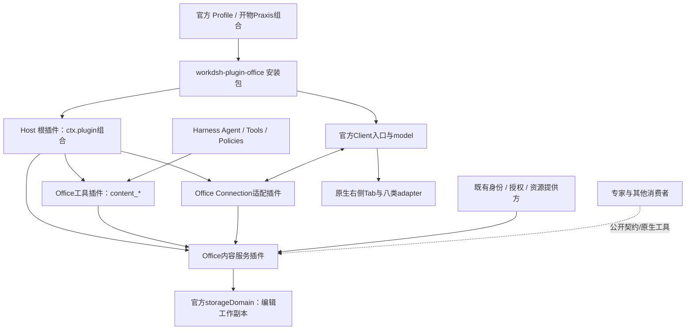

# Office 的 Harness 插件架构与交付约束

日期：2026-09-12。状态：Review后的目标设计，待实现与运行验收。任务OFFICE-AI-01，沿用Office模块0.1与U1—U5，不另建平台或执行器。

## 1. 插件身份与组成

**Office操作由独立可安装的`workdsh-plugin-office`提供。** 它通过官方`dsh.bundle.patch`、Loader/Profile、Cordis服务/工具及Client模块接入Harness。开物Praxis默认组合只选择/配置这个包，不拥有其编辑、工具或数据实现。

一个安装包可以包含多个正式Cordis插件模块。首版保留一个Office包，在包内按职责组合，不为八种文件强制建八个npm包，也不把每个文档变成代码插件。Tiptap/Univer/Konva等是该包使用的编辑基础库；它们各自的扩展机制不承担Harness插件安装/权限/生命周期。

| 组成 | 归属与职责 | 装配与依赖 |
| --- | --- | --- |
| 根Host入口`.` | Office配置与正式子插件组合 | 保留稳定行`workdsh-office`；仅用`ctx.plugin`挂载模块，禁止直接`applyX(ctx)`；不内建其他业务插件 |
| 内容服务插件 | 提供拟定`ctx.workdshOfficeContent`；拥有工作副本、纯数据操作、修订与收据 | 官方Service/具名服务；必需注入storageDomain及既有身份/授权/审计服务，缺失即停止相关操作；初始化未完成不得提供ready能力 |
| 工具插件 | 注册六个`content_*`工具与必要的使用指导 | 注入`tools`及内容服务，复用官方工具策略/系统提示词/执行日志；服务未就绪不注册可写工具 |
| Connection适配插件 | 将认证Client请求映射到同一服务 | 注入官方`connection`及内容服务；只管理Office领域路径，沿用rc.1已记录的exact Fetch例外 |
| `./client`入口 | Client model、Tab/预览/工具卡片贡献及类型适配模块 | 官方`dsh.client`图与Cordis生命周期；UI只接model投影的状态/actions |
| 八类adapter | 类型模型操作、编辑器事务映射、浏览器codec与资源 | 包内确定的类型映射、按需载入SDK；有运行副作用的模块用官方`ctx.plugin`/effect托管，不建立动态代码市场或自制PluginManager |
| 公共契约 | 服务类型、版本化DTO、能力/错误语义 | 拟定`workdsh-contracts/office`仅声明契约；Host不能裸导入当前private contracts运行时值，校验/领域实现由Office源码拥有 |

U1 已以包内正式插件实现 ContentService/Tools/Connection，并注册五个工具；公开包入口仍为`.`、`./client`，契约通过 type-only `workdsh-contracts/office` 导出。表中六工具、八类和全生命周期仍是目标，实际子集见[U1 实施记录](U1-IMPLEMENTATION.md)。细分模块的`inject`名、公开包导出与props在U1按锁定发布包确认，禁止猜测并用全局变量补齐。

公共服务调用和工具调用共享授权/校验/提交实现；UI不通过调用Agent工具来保存，工具也不通过点击UI写文档。工具注册可选关闭时，已授权页面仍可工作；缺身份/授权服务时禁止降级为无鉴权。所有消费者通过公开契约，不导入Office、experts、skills等其他插件的内部源码。

## 2. 数据所有权，避免重复实现业务插件

| 内容 | 唯一所有者与边界 |
| --- | --- |
| 编辑工作副本 | Office；同一授权资源reuse得到同副本、同一写入口 |
| 原件、导出文件、正式资产 | 官方资源owner/后续library；Office保留引用、来源hash和受控修订，不建立第二套资料库 |
| 专家定义、技能、会话与模型执行 | 各既有插件/Harness；Office不复制专家配置、不静默替换preset、不维护Agent状态 |
| Office多维表格 | 首版为独立内容文档：文档内部多表、字段、记录、关系、筛选/排序视图；事务与ID限于该document，持久化为Office工作副本/导出资源 |
| `tables`业务数据库 | P3-03仍归tables插件；不得把Office文档冒充其在线数据源，也不得将真实业务记录复制为第二份可写真源。后续接入先定义公共服务、授权与事务契约；当前只有显式导入副本，使用新ID并记录来源，不承诺双向同步 |
| HTML源码及隔离预览 | Office编辑内容；不是pages发布实例，不得到连接器或Host工具权限 |
| 业务页面/发布/撤销 | 仍归pages插件；HTML导出不等于发布。后续只能按已授权、已实现的公共契约交接固定资源修订 |

因此八类编辑无需提前实现library/tables/pages全模块；已有授权资源提供方可满足本地文件链路，但必须在U1验证其真实读写公开面。不存在提供方时返回缺失能力，不能让Office绕过资源owner直接扫描文件系统。

## 3. 生命周期、配置与恢复

首版配置表达已实现类型集合、是否启用AI工具以及容量限制。配置中的类型名是严格枚举，不接任意模块路径。停用类型后保留其文档与收据；可以读取基本元数据/诊断，禁止未验证版本重写或导出。SDK载入失败只影响该adapter；不销毁其他类型，恢复后按当前修订重建镜像。

所有工具/服务/route/Slot注册都归Cordis Fiber；Client计时器、请求、SDK、worker、Observer、DOM监听、Blob URL、样式和字体资源有可等待的清理。原生编辑器共享Harness renderer的React，不打入第二套宿主React根；只有执行HTML用户内容的隔离预览使用受限iframe。卸载不删除持久文档、源文件或共享技能。

停用/升级必须遵循以下业务顺序，不将“官方dispose”当作自动完成业务保存：

1. 关闭本代新请求准入，发布不可用状态。请求同时绑定exec.signal与插件本代signal；所有排队提交在写入前重验准入。
2. 取消未开始提交的任务，等待已进入持久化提交点的操作完成；成功回执仍为committed，不能因卸载改写成失败再重复执行。
3. 本代服务停止前清理人工lease/导入/导出领取凭证；重启后新运行代使旧凭证失效。记录未完成业务请求以供恢复，不保存失效的Service/Connection对象。
4. 旧导入/导出/预览worker晚到响应必须带本代标识与请求输入hash校验；只回收旧临时资源，不得提交到重装后的新代。已冻结的导出输入保留，同ID由新客户端重新领取并核对持久结果。
5. 同一状态域的新owner仅在旧owner停稳后打开；进程崩溃恢复先对账回执/文件hash，再接受写入，不允许两代同时写。已保存内容可恢复，未提交本地缓冲不能声称已持久。
6. 注销工具、路由、Tab贡献，等待依赖消费者释放；重新装配从持久状态恢复，不重新生成用户对象或重复注册工具。

标准模式、PTC只看到由官方作用域/策略允许的工具。Schema是本发布版已验收操作的联合，注册后不原地修改；capabilities再按类型启用、文档限制和客户端/codec可用性收窄。热更需注销后重新注册，旧Agent计划调用仍由服务校验并返回明确不可用，不绕过工具过滤。

U1检查服务名、工具wire name、route与Slot key是否冲突；冲突显式失败，不覆盖其他插件。业务审计与Harness工具执行日志分别保留自己的事实；无密钥/全文泄漏的审计元数据按既有治理契约登记，不能复制会话日志作为Office运行表。

## 4. 打包与商业使用约束

制品沿用`workdsh-plugin-office@0.1.x`，包含Host/Client构建产物、`cordis.patch.yml`、README/CHANGELOG、必要CSS/字体/WASM/worker与LICENSE/NOTICE。只分发实际实现的能力。未来拆分独立提供方时另写ADR及包契约，本轮不生成空插件包。

- 发布前在构建环境生成完整产物；干净Profile安装`.tgz`不需要开物Praxis checkout、根`scripts`、开发node_modules或安装时拉取CDN。开发build脚本位于根目录不妨碍预构建tarball，但不能宣传当前源码安装已自包含。
- Harness/Cordis/React运行边界按官方peer与Client inject/external声明；dev依赖锁定0.1.5-rc.1/4.0.2对应族。浏览器包不得引入Host/node:fs/child_process；Host包不得内联另一份Cordis框架。现有iframe探针不作为原生Client图兼容证据。
- SDK、worker/WASM和字体版本成组锁定，全部同源受管资源交付；组件采用不等于codec已实现。每类都分别记录新建编辑、导入、显示、原生对象编辑、未支持对象保留、导出重开的能力矩阵。
- 保留采用的开源发行物与实际传递依赖LICENSE/NOTICE。当前package为private，适合开发/本地tarball验证，不能称已发布npm；registry发布前处理private/包元数据并执行发布门槛。商业可用采用路线不改变产品代码里的真实限制。
- 安装进Profile、Cordis激活与业务能力可用分别确认。独立安装包含必要的官方Host/Web组合与显式治理依赖，不要求安装专家/技能/工作台。默认开物Praxis组合装配Office一次，不能导入其内部实现。

官方[打包与安装](https://deepseek-harness.github.io/deepseek-harness/develop/basic/publish)区分配置层与普通依赖；[服务依赖](https://deepseek-harness.github.io/deepseek-harness/develop/framework/service)说明inject与卸载后的消费者行为。精确CLI参数和公开扩展面以锁定rc.1的本地探针为准，本文未执行安装/卸载/发布。

## 5. U1—U5必须通过的插件门槛

| 门槛 | 所属切片 | 必验结果 |
| --- | --- | --- |
| OP-T01 配置与依赖 | U1 | 干净Profile中的预构建包真实ACTIVE；缺必需服务PENDING/启动错误FAILED有诊断；默认组合只挂一次 |
| OP-T02 工具与服务 | U1/U2 | 六工具合法schema/规范结果；UI与工具同修订；Native/PTC实际可见性与拒绝分支；工具关闭不阻断已授权UI |
| OP-T03 原生Client | U1/U2 | 一个官方React owner；无内部源码/Host代码混入；CSS不污染外壳，WASM/worker/字体在干净包内可加载 |
| OP-T04 在途卸载 | U3 | 提交前取消不写、提交后回执不丢；旧代晚到导入/导出不能写入新代；同ID不重做 |
| OP-T05 数据与消费者 | U3 | 移除/重装后文档与修订恢复、其他专家/技能/资源不变；消费者不持有旧service句柄 |
| OP-T06 codec能力 | U4 | 八类逐项显示/编辑/导入/导出与格式损失验收；未支持对象不能静默丢失；local multidimensional document不冒充tables业务库 |
| OP-T07 完整制品 | U5 | 干净安装/升级/回退策略/停用/重装，许可证清单与打包清单；无需额外Office服务/上传/运行时CDN，真实模型与视觉证据分别保存 |

U1需先用最小真实文档能力验证包结构、服务依赖、工具与Client图，再扩展复杂格式；不会仅产出八个空入口。生命周期的完整故障门槛放U3，发布门槛放U5，但从U1起按同一所有权实现。

## 6. 本轮证据与仍未验证项

静态确认：Office现有package包含`.`/`./client`、`dsh.bundle`/`dsh.client`及patch，Client使用documentPreviews/Slot；Host仍是空apply。构建脚本生成内嵌iframe，不能据此推导Tiptap等原生Client集成通过。Cordis4.0.2公开声明含Service/ctx.plugin/effect；官方镜像见[Service](../../dsh-v0.1.6-alpha.2/cordis-api/service.zh.md)、[工具](../../dsh-v0.1.6-alpha.2/cookbook/adding-a-tool.zh.md)、[Client模块](../../dsh-v0.1.6-alpha.2/subsystems/client-modules.zh.md)。

本轮为静态Review与文档修订；上述新增服务、工具、生命周期和制品门槛全部仍待实现/运行测试，不修改已运行应用或发布包。
