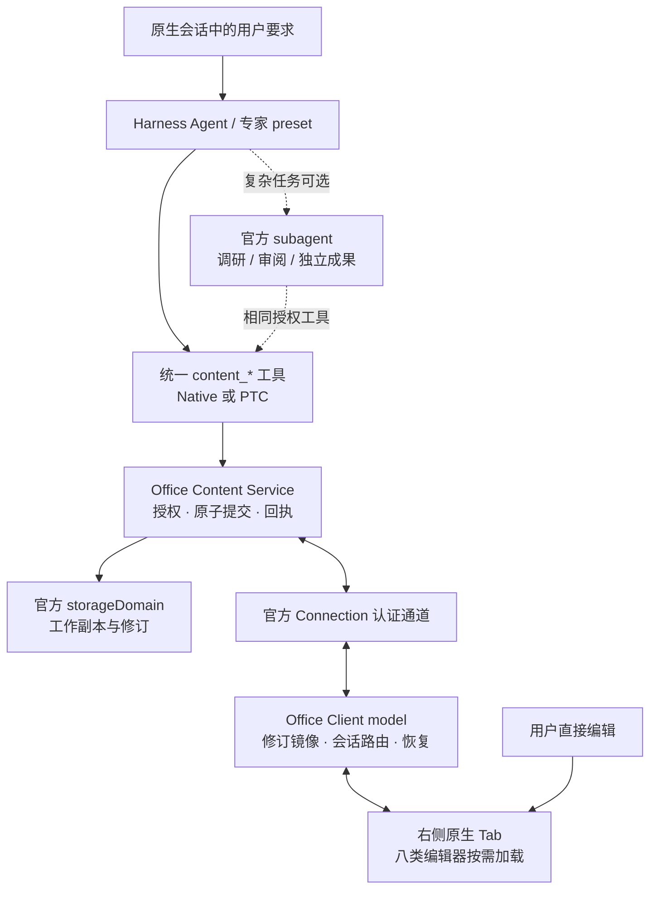

# 统一内容操作 API：AI、用户与八类编辑器

日期：2026-09-12。设计 v0.4；补齐官方插件装配、生命周期和交付边界，保留HTML/Markdown正式分支；完整八类契约尚未发布；2026-09-12 已落地最小 document 公共类型、五个原生工具与确定性 UI 验收，见 [U1 实施](U1-IMPLEMENTATION.md) / [证据](../../evidence/office-live-u1.md)。

当前实现增量（Office 0.1.0-alpha.2 开发候选）：共享的 block 信封新增 table/image，runs 在这两类必须为空；表格有 rows/cells/colspan/rowspan/colwidth(px)/正文段落，作为单个 blockId 原子替换，尚未开放单独 rowId/cellId 操作。图片为有界嵌入 PNG/JPEG（每张512 KiB），尺寸px/对齐/alt；受管文件资产引用继续作为后续设计，不声称已经实现。AI/页面仍复用三个 block 操作、CAS、幂等收据与人工租约。当前批次1 MiB，文档2 MiB。DOCX 工作副本导入及导出支持该子集，原始文件保留；完整分页、浮动图、嵌套表格和单元格图片不在此增量内。详情与官方复用记录见 [TABLES-IMAGES](TABLES-IMAGES.md)。以下各段保留长期目标，与已发布接口子集区分。

对应 ADR-0024、OFFICE-AI-01。处理 [Review R01—R06](UNIFIED-API-REVIEW.md)，取代原157行方案；实现时同时阅读 [Harness 集成决策](HARNESS-INTEGRATION.md)。

组件决策已按用户后续指令收敛，见[开源组件采用方案](OPEN-SOURCE-STACK.md)：文档Tiptap/ProseMirror、表格Univer、演示与画布Konva、PDF.js/pdf-lib/PDFium、HTML的CodeMirror/隔离预览、Markdown的Tiptap/CodeMirror与Mermaid/KaTeX。公共接口和Host权威提交保持不变。

## 1. 决策与边界

采用 Harness 原生 Agent + 统一内容工具 + Office 领域服务 + 八类浏览器编辑器适配器。单 Agent 即可分批写入、让页面实时显示；PTC 是同一工具的程序化调用方式；子智能体只用于有独立分工的复杂任务，不是实时编辑的前置条件。

统一入口、身份、修订、能力发现和回执；文档、演示、电子表格、PDF、画布、多维表格、HTML、Markdown保留各自模型。AI不直接调用厂商SDK、不提交任意执行指令/DOM selector/未校验厂商JSON；HTML文件中的脚本属于受管内容，只能在下述预览隔离边界内运行。Office不创建第二套Agent loop、MCP服务器、模型路由、通用工作流或插件加载器。



Host 负责领域数据的提交和持久化，浏览器负责交互/渲染/格式转换。禁止本机 Office/LibreOffice、服务器 Office 转换和第三方文件上传。文件来源与正式成果仍归官方文件资源/资料库；Office 只管理编辑工作副本。许可、原生编辑、格式保真分别验收，Harness 可扩展不等于编辑器能力已齐全。

### 1.1 本接口属于Office插件

实施必须遵循[插件架构](PLUGIN-ARCHITECTURE.md)。`workdsh-plugin-office`是独立安装制品：根Host用`ctx.plugin`组合内容服务、工具与认证Connection适配；Client用官方模块图组合model、Tab与八类adapter。拟定`ctx.workdshOfficeContent`是该插件提供的领域服务，不是开物Praxis全局内核或第二套插件系统。六个工具是服务消费者，原生页面通过Client/Connection调用同服务；默认开物Praxis组合不得直接初始化Office内部实现。

公共契约`workdsh-contracts/office`现已导出 U1 文档子集的类型；完整八类仍是目标设计。遵守ADR-0019的Host自包含要求，领域运行值/校验由Office拥有，不裸import private workspace contracts值。必需身份/授权/存储服务用官方inject；optional编辑器失败不能牵连全部页面。具体包与公开service名称在U1验证，不能以这段设计声明接口已存在。

`database`代表Office独立多维表格内容文档，关系和事务限定在document内部；不等于P3 tables业务数据库。`html`代表内容编辑/隔离预览，不等于pages发布。后续连接这些插件须通过公开契约且保持唯一数据owner，首版不复制同一业务数据为另一份可写真源。

## 2. 对 AI 的六个入口

以下均为拟定工具。未发布的 content_create 改为 content_open，统一新建与已有文件入口。

| 工具 | 参数/分支概要 | 结果 |
| --- | --- | --- |
| content_open | source 判别联合、operationId | 工作副本ID、识别类型、revision、导入状态 |
| content_read | query：大纲、目标内容、会话文档列表、操作/导出/展示状态 | 有界内容/修订或精确请求状态 |
| content_capabilities | kind 或 documentId | 操作schemaVersion、限制、读写/导入/导出能力与缺失原因 |
| content_edit | documentId、baseRevision、operationId、operations[] | 原子提交收据，或明确未提交的结果 |
| content_present | documentId、target?、follow、requestId | requested/queued/displayed/expired |
| content_export | documentId、revision、format、destination、exportRequestId | 固定修订导出请求；完成后才给实际资产回执 |

source 互斥分支：new（kind/title/授权workspaceRef）、resource（授权resourceRef、intent=reuse或fork、expectedSourceHash?）、existing（documentId）。实际文件类型由内容识别，不能相信模型声明或仅看扩展名。content_read.sessionDocuments 仅列可信当前会话关联且仍获授权的文档并分页；其他查询要求精确文档/目标/请求ID。新任务可重新open资源，无需猜ID或扫描所有人的文件。

通过 defineTool 声明严格联合与规范JSON输出。显式对象 additionalProperties:false；工具根DSL默认开放的部分由服务再次严格校验。只有实际通过准入的操作进入schema，capabilities再按当前文档收窄。不能以截图、文本表单或整个文件覆盖替代未支持操作。

工具注册定义保持不可变：schema为本发布版已验操作联合，当前类型启停、文档限制与浏览器codec就绪情况由capabilities/服务准入判定。更新定义须经官方dispose/re-register，不原地修改借用的schema，也不因安装了SDK就给Agent增加能力。停用AI工具仅移除工具消费者，已授权UI可继续；停用Office服务则所有消费者停止写入。

预期业务冲突返回可判别规范值，例如 `{status:"blocked",code:"REVISION_CONFLICT",currentRevision:8}`，无committedRevision；权限/基础设施错误走工具失败。Native与PTC均读status，不将queued/blocked渲染为完成。PTC的ToolCallError不公开内部错误码，不能靠catch(e).code控制重试。

## 3. 文档身份与已有文件（R03）

文档ID是工作副本身份，不是文件路径或SDK unitId。Host建立组织、所有者、授权资源、workspace及Session关联；每次读写/轮询/展示/导出重验权限，关联本身不授予权限。

- new：ID在服务端命名空间按组织+主体+workspace+new+operationId稳定派生；同ID不同创建参数拒绝。
- resource/reuse：按组织+owner+workspace+规范资源身份映射；不包含源哈希和Session ID。UI与AI打开同一授权来源得到同副本；跨主体共享须显式资源授权，首版不自动复用他人副本。
- resource/fork：映射增加operationId，返回新副本及来源关系。
- existing：重验授权，返回原ID；来源变化仍按以下规则处理。

Host通过授权资源owner解析真实地址、规范路径/符号链接、版本/哈希，任意模型字符串不等于resourceRef。新建内容先返回contentRef（工作副本引用），导出成功才有文件resourceRef，不伪造DOCX路径。

首次创建由服务内按确定性documentId的临界区串行，覆盖get→put完成；put不是put-if-absent。一个领域只由一个Host owner打开，多进程共享写入不在首版承诺内。索引只作可重建加速，不承担身份/提交真源。

导入状态：awaiting_client→importing→ready/unsupported/failed。先持久登记ID、源哈希、请求与回执；客户端经原授权资源通道取固定字节，在浏览器转换，提交严格版本化模型。完成请求使用Host签发、绑定文档/源哈希/适配版本/客户端的单次凭证；Host验证模型、大小、引用，原子完成ready。无客户端保留awaiting_client，导入未完成不能编辑。

再开时源哈希变化返回SOURCE_CHANGED并保留编辑副本；用户可另建副本或明确重新导入，不静默覆盖。加密/不支持格式拒绝可编辑导入，可以独立只读预览。资源内容中的指令不能改变权限。

## 4. 权威内容模型和原生UI映射（R01）

每类保存一个版本化ContentState判别分支。首条document链路选择规范化富文本模型，Host执行纯数据操作，浏览器双向映射；不接受无约束SDK整体快照。

document浏览器adapter明确采用Tiptap/ProseMirror开源事务模型，映射到下述领域结构。DOCX导入保留不可变原包及受控原始XML锚点，变更集合由已提交操作派生；局部导出避免丢弃未修改内容，不把文件原包变成另一条独立写入链。

| document v1数据 | 形式与规则 |
| --- | --- |
| 文档 | modelVersion、稳定ID、有序blockIds、block字典、页面尺寸/边距pt |
| 块 | paragraph、heading(level1—6)、listItem(列表ID/类型/层级)、table；稳定blockId |
| 富文本 | 有序runs：runId、text、marks；允许bold/italic/underline/strike、颜色、字号pt、字体名、授权链接 |
| 段落 | 对齐、缩进pt、段前/后间距pt；显式缺省值 |
| 表格 | tableId、rowId/cellId、有序行列、列宽pt、单元格块；v1不支持合并时禁用相关入口 |
| 资源 | 受管资源ID/哈希；图片字节由资源owner管理，不任意请求远程URL |

未改变的run保持ID；拆分由Host分配新ID，删除ID不能指向相邻内容。文本范围按Unicode code point偏移，UI负责转换UTF-16选区，不能截断代理对。选区属本地视图，按blockId/runId/偏移恢复，不作为共享内容。

AI与UI动作同样归一为document.insertBlocks、replaceText（目标+前置文本摘要）、setMarks、setParagraphStyle、splitBlock、joinBlocks、tableCellEdit等版本化操作。批内clientRef可以引用此前新增对象，回执给真实ID。所开放的原生按钮/快捷键必须完成映射；未支持操作不进入schema或UI能力。

粘贴按允许列表解析块/runs；包含不支持富文本时提示选择受限粘贴，不静默丢格式。未知模型字段拒绝，不开放extensions:any。不能表达的导入对象保留原始资源字节与不透明引用，所在范围只读；若不能保持位置/关系或安全导出，整个文件只读。保留原始ZIP不等于可无损导出。

远端更新通过现有实例的事务应用，保留选区/滚动并标记为远端，禁止反馈回写。不能每批重建SDK实例。任何无法往返的SDK修改入口必须禁用，不能等AI写入后才丢失人工样式。

其他七类分别使用幻灯片/元素、工作表/单元格、PDF源+页面/内容对象、画布对象/连接、字段/记录/视图、HTML源码资源、Markdown源码模型。各adapter开工前定义modelVersion、字段白名单、ID、迁移与UI映射；未实现分支不进入运行schema。模型迁移失败保留原记录，不由旧adapter重写。

### 4.1 HTML与Markdown源码和原生编辑

两类均是可新建、导入、编辑、保存重开的正式类型，类型名为html、markdown；既有HTML/Markdown只读预览不算完成。源码保留换行和未知语法，不强制先转换为document分支。共享修订协议，分别声明以下模型：

| 分支 | 权威字段与派生视图 |
| --- | --- |
| html | modelVersion、entryFileId、有序sourceFileIds、源码文件字典（稳定fileId、规范相对路径、HTML/CSS/JS类型、source）、受管assetRefs；CodeMirror、解析树和隔离预览均从当前修订派生 |
| markdown | modelVersion、source、明确的dialect与受管assetRefs；源码范围索引、Tiptap富文本、预览与目录均是派生视图 |

textEdits采用当前baseRevision上的Unicode code point半开区间start/end、expectedText和replacement；一批区间不可重叠，统一按基线从后向前应用，失败整批不提交。HTML必须同时指定fileId。读取返回有界源码/范围/摘要；范围只对返回的修订有效，不能把行号或AST数组下标当永久对象ID。源码导出使用冻结修订的原文，不对未修改内容自动格式化。

Markdown正文编辑使用已验证的源码范围映射，只重写实际编辑的支持块；源码与正文切换先提交/保留本地事务，再映射同一修订。不支持的front matter、脚注或扩展语法在正文视图保留为不可破坏的源码块，源码模式仍可修改；不能通过整篇parse/serialize把它们删掉。Mermaid与KaTeX只渲染受限内容，代码块不执行，MDX不作为可执行组件加载。

HTML源码编辑与实时页面预览同Tab，可切换/分屏；无需额外文字片段表单。预览资源按受管fileId/assetRef解析，禁止任意路径/目录枚举。预览使用隔离来源/iframe，不携带Host凭据、工具或Connection桥；脚本仅在允许脚本但不允许同源/弹窗/顶层导航的隔离框内运行，并以CSP阻断外部网络请求。预览消息必须核对窗口、实例代与一次性标识，不能据其请求调用Host工具。包内相对CSS/JS/图片随冻结清单解析，未解析外链明确显示缺失；HTML ZIP导出保留相对路径与资源，单文件不能保存全部资源时不冒充完整导出。

内容提交成功与预览成功分别报告。HTML脚本错误、Markdown解析错误允许保存源码并返回诊断；显示回执区分source与preview，只有当前修订的预览应用成功才报告预览已更新。源码生成中不完整的标签/代码块不能清空已保存内容。通用HTML所见即所得布局编辑未列入首版能力；本次正式交付源码编辑与实时可交互预览。

## 5. 原子提交与幂等（R02）

Harness的单次KvTable.update是写链上的原子读改写，不假定跨表事务。每文档一条DocumentRecord，内容/修订/操作回执/人工lease/导出记录在同一记录提交。

```ts
// 设计形状；业务子类型必须由严格schema定义，不是可调用SDK。
interface DocumentRecord {
  documentId: string;
  modelVersion: number;
  revision: number;                 // 仅内容提交递增
  state: ContentState;
  stateHash: string;
  receipts: OperationReceipt[];     // 主体、请求类别、ID、规范负载摘要、结果
  writerFence: number;
  lease: HumanLease | null;
  exports: ExportRecord[];          // 受理时冻结输入或已持久的不可变引用
  // ownership、source、导入状态也在同一严格记录内。
}
interface EditRequest {
  documentId: string;
  baseRevision: number;
  operationId: string;
  operations: ContentOperation[];
}
interface CommitReceipt {
  status: 'committed';
  documentId: string;
  operationId: string;
  committedRevision: number;
  stateHash: string;
  changedTargets: string[];
  createdTargets: Record<string, string>;
  contentRef: string;
}
```

提交顺序：

1. 由ToolRunContext或认证Connection建立Actor/Session，检查授权、schema、限额；不能接受模型填actor/organization替代身份。
2. 进入唯一领域写入口。等待时已取消则退出；update回调内再检查记录、授权准入围栏和取消。回调同步纯变换，不访问外部服务、不发送事件、不改原对象；异步授权提供方需在服务准入边界完成并检查撤权围栏。
3. **先查同主体/请求类别/operationId回执，再判baseRevision**。摘要相同返回原结果，即使内容已经前进；不同摘要拒绝。
4. 对尚无回执的新操作验writerFence、人工lease、baseRevision、目标/约束/批内引用。隔离副本apply全部成功后，一次update写state、revision+1、hash、receipt；一个操作失败则整批不提交。旧成功请求不会仅因后来人工接手而变成未提交。
5. await持久化成功才返回committed；domain/changed只是进程内失效提示，不是客户端显示回执。取消不能撤销已进入持久提交点的批次。

新建、导入完成、手动编辑、AI编辑、导出受理分别有请求类别；摘要包含协议版本与规范请求。回执中断/重启后同ID查询或重试，不更换ID重放不确定写入。纯重试不增加内容revision。

v1文档生命周期内不删除成功回执、不复用ID。建议初始限额：每批128KB/100操作，单记录含收据/冻结输入32MiB，每文档10,000条成功操作；由U1实测调整并在capabilities公开。内容准入时须为一次冻结导出及必要控制元数据预留空间，不能到限才申请。到限返回LIMIT_REACHED，保留读取/导出，不淘汰去重后静默重放旧请求。资源字节不嵌入记录；长期历史压缩/大文件/多进程事务另设存储版本，不靠无限增长。

## 6. 八类语义操作与边界

| 类型 | 目标/操作族示例 | 单独验收的边界 |
| --- | --- | --- |
| document | block/run/table/cell；insertBlocks/replaceText/setMarks/splitBlock/tableCellEdit | 原生富文本往返与DOCX格式保真分开 |
| presentation | slide/element；addSlides/updateElement/removeElements | 位置尺寸pt、旋转deg；母版/图表/布局支持范围 |
| spreadsheet | sheet/range；addSheet/setRange/formatRange | sheetId+A1、矩阵尺寸；不新增公式引擎，图表/导出另验 |
| pdf | page/annotation/formField；annotate/fillFields/reorderPages | 旋转归一后页面左上原点pt；覆盖层不叫正文重排 |
| board | element/connector；addElements/updateElements/connect | 画布逻辑px、稳定连接端点、撤销/序列化 |
| database | table/field/record/view；addFields/upsertRecords/setView | 强字段类型、关联、视图筛选排序，不能只提供普通网格 |
| html | fileId/source range；addSourceFile/editSource/removeSourceFile/setEntry | 严格相对路径、前置文本/修订；源码保存不等于预览运行成功 |
| markdown | source range/section；editSource/appendSection | CommonMark/GFM及声明扩展；正文/源码同修订、未知语法保留 |

实际op带类型前缀，如document.insertBlocks；每类严格判别联合，不开放任意payload。文档新增块使用runs，不同时存在含义冲突的text字段。capabilities返回不可编辑对象、转换损失、浏览器需求。图片/图表/嵌入未验收不进入可用能力。

PDFium真正文本/图片编辑新增为目标能力：浏览器及字体往返通过后再加入pdf.replaceText/updateImage严格分支，使用源hash/pageId/对象签名/前置文本约束，不以WASM指针做持久ID；此前的注释/表单操作不是完整PDF编辑范围的终点。

## 7. 同步、会话路由与显示回执（R04）

首版锁定0.1.5-rc.1，复用已验证的官方Connection认证exact Fetch扩展面，拟定Office专属路径 `/api/workdsh-office`。只承载严格领域DTO，不是通用RPC/自制WebSocket/新端口；不导入专家内部适配器。Remote生成缺口及迁移门槛见 [集成决策](HARNESS-INTEGRATION.md)，不能假设ctx.remote.office存在。

Office Client model管理以下流程，React只消费snapshot/actions：

1. Tab激活立即读取同一次权威快照的revision/hash/state。
2. 活跃文档每500ms进行非重叠revision/status查询，变化才读取内容；单客户端批量查询可见文档。后台页面降至5s，重新可见/connection reset立即查询。轮询不消耗模型调用。
3. 应用快照后立即核对最新水位。快照5之后即使只发生一次写6，下一次查询也必然发现，不需写7触发。旧响应不能覆盖新版；同revision异hash是协议错误，停止写入并诊断。
4. 没有人工缓冲时应用最新快照或已验差量；有缓冲按第8节处理。SDK事务完成且渲染无异常后才回执appliedRevision/hash。
5. 断线保留最近镜像，指数退避至5s，重连立即校准。每次查询鉴权；撤权清除镜像并停止读取。卸载清理请求、监听、计时器与SDK。

500ms为默认查询间隔，不是端到端保证。本机正常条件以“提交至渲染p95≤1秒”为验收目标并记录设备/文件大小/批次。未来迁移官方流式通道须验证先注册监听→baseline水位→高于水位的增量→重连replacement；domain/changed不能直接当网络广播。

present持久请求包含requestId、Host解析的sessionId、documentId、requestedRevision、target、expiresAt（默认5分钟）。Agent的Session来自exec.agent；模型不能任意指定别人的会话。子Agent展示到父会话必须有显式runtime binding。

客户端只领取自己已授权且当前挂载Session的请求；同会话多窗口用短期领取凭证保证一次自动打开。切换到B不处理A；领取过期可重新领取。sidebarRight写操作只在目标Session已挂载时调用，未打开会话为queued，无适合客户端为CLIENT_REQUIRED，不偷换当前会话。

工作副本通过注册Office Tab kind与校验后的documentId参数打开；真实文件继续官方资源/预览扩展，Tab参数不是权限凭证。显示回执绑定requestId、client实例/连接代、文档ID、实际revision/hash；旧连接回执忽略。允许appliedRevision≥requestedRevision但明确显示实际版，不声称看到旧版。跟随AI滚动由用户决定。

## 8. 人工接手、取消与撤销（R06）

首版采用文档级人工lease + revision CAS，先保证人能完成输入，不引入CRDT/自动文本合并。

- 用户实际开始修改前，Client model经认证Connection申请lease；Host同记录原子取得并递增writerFence，返回最新基线。UI取得前暂存输入意图，不在未知旧版提交；纯阅读/选区不占lease。
- lease绑定主体/客户端/连接代，只有持有者可提交；模型伪造source=human无效。期限默认30秒、活跃编辑10秒续租，Host时钟裁定。AI新批次返回HUMAN_EDITING，不循环重试或阻塞等待；已排队请求重新查围栏，已提交保留。
- IME的compositionstart至compositionend只在本地缓冲，结束后以事务保存，不逐拼音提交。停止输入防抖后自动保存；明确完成或失焦且已保存才释放lease。有未保存缓冲不因失焦丢弃；持续输入续租。
- 断线/重启使旧连接lease/fence失效；保留可恢复缓冲，重新取得lease/基线后提示合并/另存变更。持久化失败保留输入并显示保存失败。
- 人工完成后，仍运行的AI下次调用读新版；已结束/暂停轮次由用户“继续”走官方会话入口。可inject人工提交的上下文，但agent.inject不唤醒空闲Agent；本版不承诺无人操作自动续跑，不新造调度器。
- 每客户端撤销仅包含自己的已提交事务，提交带目标前置条件的逆操作并生成新revision，不回滚整篇旧快照或撤掉别人修改。SDK原生撤销栈需过滤远端事务，快捷键走同语义；冲突明确失败。

同文档AI批次依次await，禁止Promise.all竞争同baseRevision。首版写工具不声明isConcurrencySafe=true；不同文档并行须先验服务安全。取消沿用exec.signal；不确定结果按原operationId核对，已提交部分保留。

### 8.1 插件停用、升级与晚到请求

请求同时受exec.signal、插件运行代与领域准入约束。卸载先停止新准入，取消尚未提交操作，等待已进入持久化的操作结算；成功回执保留。工具/route/Slot/Client查询与SDK资源归官方Fiber并按停稳顺序清理，服务消费者不得缓存旧句柄。

导入/导出领取及展示回执额外绑定运行代，旧worker即使晚到也不得写入新代。重装恢复冻结输入/回执/文件hash后重新领取；人工lease和旧连接凭证失效。同状态域的新服务只能在旧owner停稳后接管；崩溃恢复先对账再接受写入。运行代是业务请求有效性围栏，不是另建Harness运行状态机。详见插件架构第3节及OP-T04/05。

## 9. 固定修订导出（R05）

v1仅导出受理时的当前revision，或同exportRequestId已受理的冻结输入；任意旧版未冻结则REVISION_UNAVAILABLE，不导出新版冒充。

一次DocumentRecord更新保存exportRequestId、请求摘要、revision、stateHash、adapter/model版本、固定快照和不可变资源hash、目标副本策略。导出元数据不增内容revision。首版每文档最多一个占用冻结输入的导出，其他新请求返回BUSY；同ID重试仍先查原回执。若源资源可变，先经资源owner持久化不可变源副本/版本，再发布受理记录；预写未引用资源可回收，不能先承诺再保存输入。

状态：awaiting_client→rendering→ready→writing→exported，另有blocked/failed/cancelled。有界转换可用官方jobs管理运行生命周期，持久ExportRecord只拥有业务输入/结果，不另记Agent运行状态。返回请求/作业句柄不等于完成。

浏览器领取绑定导出ID/输入hash/adapterVersion的限时凭证，在独立只读转换实例上使用冻结快照，不读当前编辑缓冲。受理8后继续写9，仍导出8。SDK版本不符/源缺失/不支持对象则拒绝或恢复原固定输入。

转换结果经官方Connection授权产物入口传给Host/资源owner校验格式/体积/hash并保存。这是持久化，不是服务器转换。destination默认授权目录下副本，v1不覆盖源文件。正式实现前必须验证资源写入owner支持确定性目标、临时写后原子发布和hash核对：文件落盘但回执丢失时同ID核对同目标/hash补回执，不重复落盘；目标被外部改变返回OUTPUT_CONFLICT，不覆盖或创建第二份。

回执含documentId/revision/stateHash/exportRequestId/format/adapterVersion/resourceRef/fileHash/bytes。客户端失联保留冻结输入，领取超时回awaiting_client；重试同ID恢复同任务。终态后可释放冻结输入但保留摘要/回执；失败后新导出用新ID，不能重用已取消ID。

仅浏览器下载时最多download_offered，不能声称Host已保存或用户磁盘已下载。AI要继续引用正式文件必须有实际资产回执；缺owner/客户端/转换能力返回CAPABILITY_UNAVAILABLE/CLIENT_REQUIRED。

## 10. AI 使用示例

open(new document)→present→edit第一批→edit第二批→read核对→export固定revision。工具描述/内置指导明确分批可见、读最新修订、人工接手停止写、以回执判断完成，不增加模型循环。

```json
{
  "documentId": "doc-example",
  "baseRevision": 0,
  "operationId": "report-batch-1",
  "operations": [{
    "op": "document.insertBlocks",
    "afterId": null,
    "blocks": [
      {"clientRef":"title","type":"heading","level":1,"runs":[{"text":"门店调研报告","marks":{}}]},
      {"clientRef":"summary","type":"paragraph","runs":[{"text":"本次调研覆盖……","marks":{}}]}
    ]
  }]
}
```

示例为拟定schema，Host分配block/run ID；回执给clientRef→blockId，读取块得到runId。每批提交后客户端自行刷新，PTC无需等整段程序结束。一次把全文塞进一个工具调用不会逐字直播。

## 11. 有限实施计划与验收

| 切片 | 交付 | 退出条件 |
| --- | --- | --- |
| U1 | 插件装配/预构建包、公开面/许可、document模型/adapter/schema | OP-T01/03：先最小真实Host服务/工具/Client，干净Profile激活；锁定工具/Connection/Storage/Tab；加粗/分段/粘贴/IME往返 |
| U2 | 文档真实纵向链路 | AI三批写→正确会话实时显示→人工改第二段→AI读新版继续→刷新恢复；新建/已有资源reuse同副本 |
| U3 | 导出、生命周期和可靠性 | OP-T04/05：在途卸载/旧代响应/重装恢复；原子崩溃窗口、同ID重试、人工lease、双客户端/会话隔离、撤权、导出8时继续写9、原件不变/副本重开 |
| U4 | 其余七类同接口 | OP-T06：Markdown→HTML→Excel→PPT→PDF→画布→多维表格，逐类填写创建/导入/显示/对象编辑/未知对象保留/导出重开矩阵；操作与codec分别验收 |
| U5 | 八类联合任务与插件发布门槛 | OP-T07：独立/默认组合干净包安装、升级/停用/重装、依赖与许可证清单；八类成果跨引用，无第三方请求；真实模型/视觉验收分别留证 |

U4新增两类的必验场景：

- Markdown：AI分批写标题/段落/GFM表格/任务列表/代码块/Mermaid/公式，正文实时显示；用户正文改一句再切源码，AI读最新原文续写，导出.md重开；验证未知语法与未修改内容保留、中文IME、取消、重连、同ID重试。
- HTML：AI分批写HTML/CSS/JS，源码和页面展示对应修订；用户源码修改样式后AI读取继续；包内图片与相对资源预览/导出重开；错误脚本/不完整批次显示诊断，外部请求/Host访问隔离有效，过期预览回执不能覆盖新版。

U1—U5为有限切片，不另造模块版本。U4因许可/兼容可调整顺序，不删类型、不把只读预览签收为编辑。子智能体归专家团SOP后续验收，不阻塞这些切片。Review六项故障用例均须运行验证。

本轮[插件复审OP-R01—06](ARCHITECTURE-REVIEW.md)与[OP-T01—07门槛](PLUGIN-ARCHITECTURE.md)纳入实施依据；整体插件制品通过不代替类型级文件保真，某类型通过也不代替插件卸载/恢复测试。专项通过已有activeSlice记录，不自动推进主线D04/D15。

当前仅设计修订；Office Host仍为空apply，content_*、工作副本持久化和实时同步尚不可用。不得以本方案或现有SDK演示宣称八类已集成。

### 2026-09-12 原生文档排版增量

已实现 run.style（字体、点字号、颜色、高亮）、block.style（对齐、行距、缩进）、block.list（类型、六级层级、起始编号、条目后续段落）。UI 和 content_edit 共用 Host 严格校验与修订事务；替换块保留全部语义属性。下载生成真实 DOCX 字体/段落属性和 numbering.xml，不通过服务端转换。仅原生工作副本范围，不表示表格/图片/文件保真或其他七类已实现。

### 2026-09-12 原生文件交付增量

content_export 已注册为受限 DOCX 交付工具：读取已授权保存修订、使用与浏览器下载共用的 DOCX codec，组合官方 bash/present 工具，输出真实路径/revision/status。官方 ui-deliverables 拥有文件卡片及打开菜单。开物Praxis 不新增自绘成果卡，不将 documentId 伪装文件路径。导出为一次保存修订的新文件；后续实时编辑不静默覆盖文件。仅此有限路径已实现，U3 全量导出任务/幂等/中断恢复协议仍待验。

### 已存图片的 AI 引用（alpha.2 开发）

content_open/content_read 的模型快照将图片 src 投影为 `office-image:<sourceDocumentId>:<blockId>:<SHA-256>`，不重复返回 Base64。将该 src 原样放入 content_edit 的 image 载荷，可在同一文档复用或复制到另一个有权限的 Word 工作副本，并调整宽高、对齐或替代文字。Host 分别检查目标编辑和来源读取权限、组织/工作区边界，核对原图哈希，再走既有修订/租约/提交。来源不变，目标独立保存原始图片字节，来源以后修改/删除不会联动目标。旧版不含源 documentId 的短引用仍限定目标文档，保持兼容。

模型快照仅为投影；页面、持久状态、DOCX 保留嵌入图片，未增加资产注册表或文件访问底座。范围仅限可读取的 Office 工作副本文档，尚不支持新文件资料/远程 URL/其余七类编辑器的跨格式制作。失效来源须重新读取；源删除后的旧引用重试仍可能失败，通用资产幂等未完成。新图片仍使用已有 PNG/JPEG 嵌入输入。
